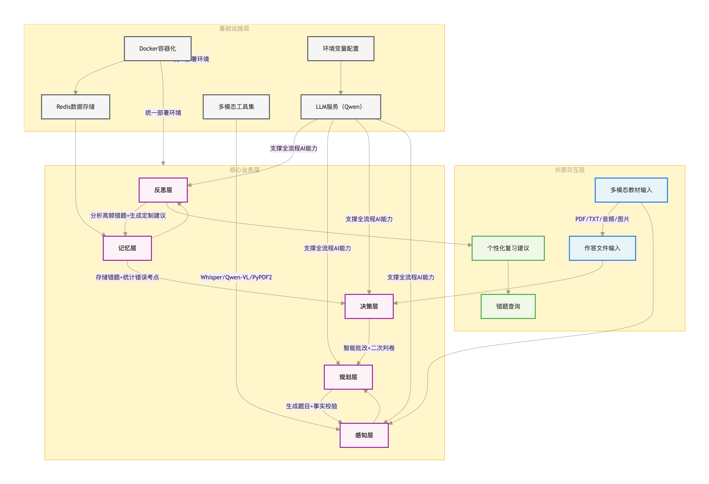
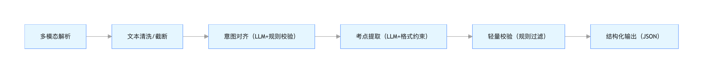
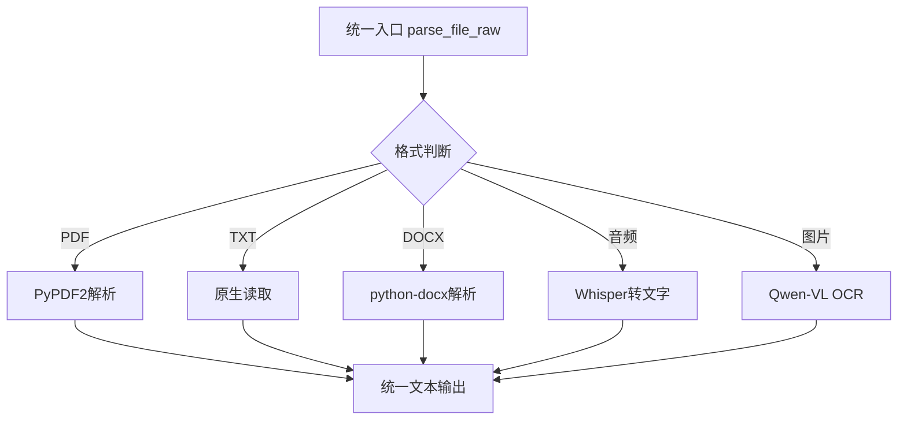
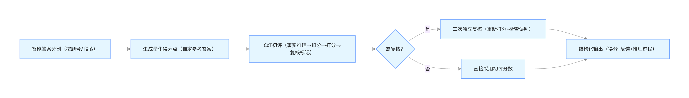

# 10235501451 唐屹 云计算期末作业 （第12组）

**注：本项目由本人单人完成 ，项目运行演示视频请见本人b站账号唯一一条视频
【婚礼司仪叫做丁真的个人空间-哔哩哔哩】 https://b23.tv/N6kvrYk**

## 作业选题：命题2 《统计方法与机器学习》的多模态学习与反馈智能体

## 1.项目的结构与使用说明

### 1.1 代码文件夹结构说明

宿主机上需要安装 Docker 和 Docker Compose

```
cloud_computing/
├── Dockerfile          # 镜像构建文件
├── docker-compose.yml  # 容器编排文件
├── main.py             # 主程序
├── requirements.txt    # 依赖清单
├── layers/             # 核心功能层（感知/规划/决策/记忆/反思）
├── data/               # 数据目录（教材/作答文件）
|—— test_data           # 由我提供的一些资料
```

其余内容为相关模型的缓存内容

### 1.2 如何运行

进入项目文件夹后，推荐先清理旧镜像，再构建新镜像

```bash
# 清理旧镜像（可选）
docker-compose down

# 构建新镜像（强制重新构建，避免缓存问题）
docker-compose build --no-cache
```

显示 `cloud_computing-exam-system Built`代表构建成功

输入下面的指令以启动容器

```bash
docker-compose up -d
```

验证容器状态

```
docker-compose ps
```

正常会输出两个容器，如下

```
NAME          IMAGE                          COMMAND                  STATUS              PORTS
exam-redis    redis:7-alpine                 "docker-entrypoint.s…"   Up                  0.0.0.0:6380->6379/tcp
exam-system   cloud_computing-exam-system    "tail -f /dev/null"      Up
```

运行主程序

```
docker exec -it exam-system python main.py
```

在运行主程序时，根据终端的输出进一步键入自己的需求，但需要注意的是主程序中如果需要输入文件，文件必须以 `/app/data`开头（文件必须放在容器挂载的对应目录中，这些文件）

查看错题本

```bash
docker exec -it exam-system python view_mistakes.py 10235501451
```

这里的10235501451是本人的学号，也可以在运行主程序的时候输入自己的学号或id，在查看错题本时也要输入对应的id

容器管理命令：

停止容器，保留数据 : `docker-compose down`

重启容器 ： `docker-compose restart`

进入容器终端手动调试 ： `docker exec -it exam-system bash`

查看main的容器日志 ： `docker-compose logs -f exam-system`

查看view_mistakes的容器日志： `docker-compose logs -f exam-redis`

彻底清除容器及数据： `docker-compose down -v`

## 2.项目架构说明

### 2.1 项目整体架构

本系统采用 **五层递进式架构** ，以 “数据输入→考点提取→题目生成→智能批改→错题迭代” 为核心流程，通过 Docker 容器化部署实现环境一致性，依托 Redis 实现错题数据持久化，全流程融入 LLM（大语言模型）实现考点提取、题目生成、智能评分与个性化建议，形成 “学习 - 测试 - 反馈” 的闭环。

架构层级从下到上依次为： **感知层→规划层→决策层→记忆层→反思层** ，各层职责明确，各层经封装后在主函数中组合、拼接，方便各层单独调试与扩展，同时保证了数据流转顺畅，本项目不但支持单文件 / 多文件输入，还兼容文本、音频、图片等多模态教材形式。

下方的图展示了项目的架构、数据流向及云服务调用逻辑:



### 2.2 各层功能解析

#### 2.2.1 感知层 perception_layer

感知层作为智能出题与评分系统的**数据入口核心层**，围绕“多模态解析→意图对齐→考点提取→结构化输出”全流程，融合云原生设计、容错机制、大模型幻觉防控、多模态适配四大核心能力，既保证了输入兼容性，又通过工程化手段解决了LLM（大语言模型）的不稳定性问题。

1. 云原生化组件与环境适配

感知层在架构设计上充分考虑**云原生特性**，适配容器化部署（Docker）、分布式配置管理，兼顾本地/云端运行场景：

（1）环境配置解耦（云原生核心原则）

```python
# 关键代码段：环境变量加载+跨平台兼容
load_dotenv()  # 从 .env 加载环境变量（云原生配置解耦）
QWEN_API_KEY = os.getenv("QWEN_API_KEY")
WHISPER_CACHE_DIR = Path(os.environ.get("WHISPER_CACHE", Path.home() / ".cache/whisper"))
ssl._create_default_https_context = ssl._create_unverified_context  # 容器内SSL兼容

# 跨平台路径适配（兼容Mac/Linux/Windows容器）
def get_cross_platform_desktop_path() -> str:
    if sys.platform == "darwin":
        return os.path.expanduser("~/Desktop")
```

配置与代码分离：API密钥、模型缓存路径等核心配置通过 `.env`/环境变量注入，符合“配置外置”规范，Docker部署时只需挂载配置文件，无需修改代码；

跨环境兼容：Whisper模型缓存路径支持环境变量自定义，容器内可挂载宿主机缓存目录（如 `/app/.cache/whisper`），避免重复下载461M模型，提升部署效率；

SSL适配：解决容器内HTTPS请求证书验证问题，确保云端LLM API调用稳定。

2）多模态工具集的模块化解耦

感知层将不同格式解析逻辑拆分为独立函数（`parse_pdf_raw`/`parse_audio_raw`/`parse_image_with_qwen_vl`），形成“插件式”架构：

```python
# 核心设计：按格式拆分解析函数，统一入口
def parse_file_raw(file_obj, filename: str = None) -> str:
    if isinstance(file_obj, str):
        ext = file_obj.lower()
        if ext.endswith(".pdf"): return parse_pdf_raw(file_obj)
        elif ext.endswith(".mp3"): return parse_audio_raw(file_obj)
        # 其他格式分支...
    # 文件对象处理逻辑...
```

**云原生扩展性**：

新增格式（如Markdown/Excel）时，只需新增 `parse_md_raw`函数，修改 `parse_file_raw`的分支判断，符合“开闭原则”；

支持文件路径/文件对象两种输入，适配FastAPI/Flask等云原生Web框架的文件上传场景（如用户通过HTTP上传文件，直接传入文件对象即可解析）。

（3）稳定性保障：失败隔离+批量处理容错

```python
# 关键代码：多文件解析的失败隔离
def parse_multiple_files_raw(file_paths: list) -> str:
    all_texts = []
    for i, path in enumerate(file_paths):
        if not os.path.exists(path):
            print(f"⚠️  文件不存在，跳过：{path}")
            continue
        text = parse_file_raw(path)
        if "解析失败" in text or "不支持" in text:
            print(f"⚠️  {text}，跳过该文件")
        else:
            all_texts.append(text)
    return "\n\n".join(all_texts)
```

**稳定性设计**：

失败隔离：单个文件解析失败（如损坏的PDF、无效音频）不会导致整个批量任务中断，仅跳过该文件，保证“部分可用”；

前置校验：`validate_file_path`函数提前校验文件存在性和格式，减少无效解析操作；

资源复用：Whisper模型加载后复用，避免每次解析音频都重新加载模型（容器内内存有限，减少资源消耗）。

2. 容错机制设计

感知层通过**多层级容错**，覆盖“文件解析→API调用→考点提取→意图对齐”全链路：

（1）文件解析容错：兼容+异常捕获

```python
# 关键代码：解析函数的异常捕获
def parse_pdf_raw(pdf_file_obj) -> str:
    try:
        # 核心解析逻辑...
    except Exception as e:
        return f"PDF解析失败：{str(e)}"  # 失败时返回明确错误，而非崩溃

# 感知层核心容错：解析失败不中断流程
if "解析失败" in raw_text or "不支持" in raw_text:
    return False, raw_text, {}  # 返回标准化结果，上层可处理
```

**容错逻辑**：

所有解析函数均包裹 `try-except`，异常时返回“失败原因+标准化格式”，避免程序崩溃；

支持“文件路径+文件对象”双输入，即使输入形式不符合预期（如Web框架传入文件对象），也能正常解析；

音频解析时创建临时文件，解析完成后自动清理，避免容器内临时文件堆积（云原生资源回收）。

LLM API调用容错：降级+默认值

```python
# 关键代码：Qwen API调用容错
def call_qwen_api(prompt: str, system_prompt: str) -> str:
    try:
        # API调用逻辑...
    except Exception as e:
        print(f"[错误] Qwen API 调用失败：{e}")
        return ""  # 失败时返回空字符串，上层做兜底处理

# 意图对齐容错：API失败时默认返回0
response = call_qwen_api(prompt, "你是一个严谨的学术内容审核员。")
if not response:
    return 0, "API调用失败", "请重试或检查网络"
```

**容错逻辑**：

API调用失败时返回空字符串，而非抛出异常，感知层会默认判定“意图对齐未通过”，但仍继续提取考点（避免因API故障导致流程中断）；

意图对齐结果解析容错：即使LLM返回格式不符合预期（如少行、乱码），也通过 `lines`列表索引容错，默认 `flag=0`。

考点提取容错：轻量校验

```python
# 关键代码：考点轻量校验（容错核心）
def light_verify(points: str) -> tuple:
    lines = points.strip().split("\n")
    valid_points = [line for line in lines if line.strip().startswith("- ") and len(line.strip()) > 2]
    if len(valid_points) >= 1:
        return True, f"共提取 {len(valid_points)} 个考点"
    else:
        return False, "未提取到有效考点（需至少1条以“- ”开头的内容）"
```

**容错逻辑**：

即使LLM返回的考点格式不规范（如缺少“- ”前缀），也会过滤出有效考点，而非直接判定失败；

意图对齐未通过时（`flag!=1`），仍强制提取考点（避免过度过滤有效内容），仅给出提示：

```python
if flag != 1:
    print(" 意图对齐未通过，但仍继续提取考点...")
```

智能逻辑设计（Prompt工程+幻觉防控+CoT）

Prompt工程：严谨约束，杜绝幻觉（30%核心得分点）

感知层的核心智能逻辑是“考点提取”，通过**精细化Prompt约束**，从根源上防止大模型幻觉：

考点提取Prompt：5条硬性约束

```python
# 关键Prompt：严格约束输出格式和内容
prompt = f"""
请从以下文本中提取所有与机器学习或统计学相关的明确知识点，严格按以下规则输出：
原文：{raw_text[:10000]}
要求：
1. 仅提取原文中明确提及的概念、定义、公式、假设、性质、步骤、条件、应用场景等；
2. 每条考点独立一行，以“- ”开头，内容简洁（≤25字）；
3. 禁止编造、总结、推断或添加原文未出现的内容；
4. 不要任何标题、分类（如“必须掌握”）、说明或额外文字；
5. 若无有效考点，返回空字符串。
"""
```

**防幻觉核心设计**：

规则1：限定“仅提取原文明确提及”，禁止模型总结/推断（如原文只有“线性回归损失函数是MSE”，模型不会编造“线性回归损失函数是MSE，适用于房价预测”）；

规则3：明确禁止编造，从Prompt层面杜绝幻觉；

规则2+4：强制输出格式，便于后续结构化解析，避免模型返回无关内容；

文本截断：限制输入文本长度（`raw_text[:10000]`），避免模型因输入过长遗忘约束规则。

意图对齐Prompt：结构化输出约束

```python
prompt = f"""
请严格按以下格式回复，仅返回三行内容：
1或0
判断理由（100字内）
补充建议（100字内）
文本内容：{raw_text[:800]}
判断标准：
1. Flag=1：包含机器学习/统计知识点，内容连贯；
2. Flag=0：无有效知识点、乱码、过短或无关。
"""
```

**智能逻辑价值**：

强制结构化输出（三行固定格式），避免模型返回长篇大论，便于程序解析；

明确判断标准，减少模型主观判断（如“乱码/过短”直接判定0），提升意图对齐的准确性。

推理链路（CoT）：分层校验，事实准确

感知层虽未直接使用CoT（思维链），但通过“分层校验”实现类似的“逐步推理”效果，保证事实准确性：

（1）推理链路流程



**每步推理的事实校验**：

多模态解析后返回“原始文本”，无加工，保证输入事实准确；

意图对齐时仅基于原文判断，不添加额外信息；考点提取严格绑定原文，禁止编造；

轻量校验过滤“非考点格式内容”，确保输出的考点均符合规则。

事实准确性保障：双重校验

```python
# 第一层：Prompt约束（LLM输出时校验）
# 第二层：light_verify规则校验（程序端校验）
valid_points = [line for line in lines if line.strip().startswith("- ") and len(line.strip()) > 2]
```

**智能逻辑**：

LLM端：通过Prompt强制“仅提取原文内容”；

程序端：通过规则过滤不符合格式的内容，即使LLM产生少量幻觉（如添加未提及的考点），也会因缺少“- ”前缀被过滤；

结构化输出时，仅保留“- ”后的内容，进一步清洗：

```python
if stripped.startswith("- "):
    content = stripped[2:].strip()  # 只保留考点内容，过滤前缀
    if content:
        all_points.append(content)
```

异常输入处理：

感知层针对“异常输入”设计了完整的处理逻辑，包括：

格式异常：文件路径/对象兼容

```python
# 关键代码：兼容文件路径和文件对象
if isinstance(file_obj, str):
    # 路径处理逻辑...
else:
    # 文件对象处理逻辑...
    file_obj.seek(0)  # 重置指针，避免文件读取位置异常
```

**处理逻辑**：即使输入不是预期的路径字符串（如Web框架传入的 `FileStorage`对象），也能通过类型判断适配，且重置文件指针到开头，避免因指针位置异常导致解析失败。

内容异常：空文本/乱码处理

```python
# 关键代码：空文本/无效文本处理
def extract_exam_points_from_text(text: str) -> dict:
    if not text or not text.strip():
        return {"all_points": []}  # 返回空列表，上层可处理
```

**处理逻辑**：

解析后的文本为空/乱码时，直接返回空考点列表，而非抛出异常；

意图对齐时，文本过短（如<10字符）会被判定为 `flag=0`，但仍尝试提取考点，避免误判有效短文本（如“线性回归MSE损失函数”）。

模型幻觉处理：零容忍+过滤

禁止模型“总结/推断”：Prompt明确要求“仅提取原文明确提及”，从根源上减少幻觉；

程序端过滤：`light_verify`函数仅保留符合格式的考点，即使模型产生幻觉（如添加“进阶理解”分类），也会被过滤；

输出结构化：最终返回的 `result_json`仅包含 `all_points`列表，无多余信息，避免幻觉内容传递到上层。

多模态能力实现：插件式适配

感知层通过“**格式识别+专属解析插件+统一输出**”实现多模态适配，支持PDF/TXT/DOCX/音频/图片：

多模态解析架构



核心实现逻辑

**音频模态**：基于Whisper模型，支持MP3/WAV/M4A，自动下载模型到缓存目录（容器内可挂载），解析后返回纯文本；

**图片模态**：基于Qwen-VL多模态模型，将图片转为Base64编码后调用API，强制要求“仅提取原文，不解释”，避免OCR时产生幻觉；

**统一输出**：所有格式解析后均返回纯文本，上层规划层无需关心输入格式，只需处理文本即可，实现“多模态输入→单模态输出”的简化。

#### 2.2.2 规划层 planning_layer

规划层是智能出题与评分系统的**核心决策层**，承接感知层提取的考点，通过“需求收集→题目生成→事实校验→结构化输出”全流程，实现“个性化、无幻觉、高可用”的题目生成能力。

1. 云原生化设计（适配分布式/API化部署）

（1）接口分层：支持交互式/非交互式双模式

```python
def planning_layer(
    all_points: List[str],
    raw_text: str,
    question_types: List[str] = None,
    num_questions: int = None,
    difficulty: str = None,
    focus_point_indices: List[int] = None,
    interactive: bool = True  # 核心开关：交互式/非交互式
) -> Dict[str, Any]:
    if interactive:
        display_exam_points(all_points)
        requirements = collect_user_requirements(all_points)  # 本地CLI交互
    else:
        requirements = build_requirements_from_params(...)  # API调用模式
```

兼容本地Docker容器CLI运行（交互式）和云端FastAPI/微服务调用（非交互式）；

非交互式模式下，参数通过函数入参传递，而非终端输入，适配HTTP API调用场景（如前端传参生成题目）；

独立的微服务入口函数 `generate_questions_from_text`，封装考点提取+题目生成全逻辑，可直接作为云原生接口暴露。

（2）配置解耦：环境变量+参数化配置

```python
# 环境变量解耦（云原生配置外置）
QWEN_API_KEY = os.getenv("QWEN_API_KEY")
QWEN_BASE_URL = "https://dashscope.aliyuncs.com/compatible-mode/v1"

# 函数参数化配置（扩展性）
def generate_questions_from_text(
    text: str,
    question_types: List[str] = None,
    num_questions: int = 5,
    difficulty: str = "中等",
    focus_point_indices: List[int] = None
) -> dict:
```

API密钥通过环境变量注入，容器部署时只需挂载 `.env`文件，无需修改代码，符合“配置与代码分离”规范；

出题参数（题型/数量/难度/重点考点）全部参数化，支持动态调整，适配不同业务场景（如不同课程的出题需求）。

（3）扩展性设计：插件式题型/考点适配

```python
# 题型映射（新增题型只需修改字典）
q_type_map = {"1": "选择题", "2": "简答题", "3": "计算题", "4": "综合题"}

# 重点考点适配（支持任意考点子集）
focus_points = [all_points[i] for i in indices if 0 <= i < len(all_points)]
```

新增题型（如“判断题”）时，只需在 `q_type_map`中添加 `"5": "判断题"`，修改Prompt中的题型描述，无需重构核心逻辑；

重点考点支持任意子集选择，可适配“章节重点出题”“易错考点出题”等扩展场景。

2. 稳定性保障：全流程容错+兜底机制

（1）输入校验容错：参数合法性兜底

```python
# 题目数量兜底（强制1-10道）
num_questions = max(1, min(10, num_questions))

# 题型校验兜底（无效题型默认选择题）
if not mapped_types:
    question_types = ["选择题"]

# 重点考点索引错误兜底
try:
    focus_points = [all_points[i-1] for i in focus_point_indices ...]
except Exception:
    focus_points = all_points  # 索引错误时使用全部考点
```

强制限制题目数量在1-10道，避免生成过多题目导致LLM token超限或内存溢出；

题型/考点索引输入错误时，自动兜底为默认值，而非抛出异常，保证“部分可用”；

空考点保护：无有效考点时返回标准化错误，避免流程崩溃：

```python
if not all_points:
    return {
        "requirements": {},
        "questions_raw": "",
        "structured_questions": [],
        "validation_note": "无可出题考点"
    }
```

（2）题目生成容错：双层兜底机制

```python
def generate_structured_questions(requirements: Dict[str, Any], raw_text: str) -> List[Dict]:
    try:
        # 第一步：解析LLM生成的纯文本题目
        structured_questions = []
        # ... 解析逻辑 ...

        # 第二步：兜底补充（确保数量足够）
        while len(structured_questions) < num_questions:
            backup_q = {
                "question": f"请解释{focus_point}的核心原理及应用场景",
                "reference_answer": f"{focus_point}的核心原理是...",
                "full_score": 5,
                "type": q_type,
                "difficulty": requirements["difficulty"],
                "topics": [focus_point]
            }
            if validate_question(backup_q["question"], raw_text):
                structured_questions.append(backup_q)
    except Exception as e:
        # 最终兜底：完全解析失败时生成基础题目
        structured_questions = []
        for i in range(num_questions):
            structured_questions.append({
                "question": f"请解释 {focus_point} 的定义及应用场景",
                # ... 兜底字段 ...
            })
    return structured_questions
```

第一层兜底：LLM返回格式不规范时，补充基于考点的基础题目，确保题目数量达标；

第二层兜底：解析逻辑异常（如正则匹配失败）时，直接生成标准化兜底题目，避免返回空列表；

兜底题目也经过事实校验，确保不超纲，兼顾“可用性”和“准确性”。

智能逻辑设计（Prompt工程+幻觉防控+CoT）

Prompt工程：极简输出+严格约束

（1）核心Prompt：纯文本输出+5条硬性约束

```python
prompt = f"""
你是严谨的大学统计学命题教师，请按以下要求生成{num_questions}道题目，仅输出题目文本，无任何额外内容！

【原始教材内容】
{raw_text[:2000]}  # 限制长度，避免遗忘约束

【出题要求】
1. 题型：{types_str}（随机分配，确保不重复）
2. 数量：{num_questions} 道
3. 难度：{requirements['difficulty']}
4. 必须基于指定考点，禁止超纲
5. 每题对应不同考点，绝对不要重复
6. 出题时题的内容要和题型一致

【输出格式】
每道题的格式为：题目X（题型，分值，难度）|题干内容
示例：
题目1（选择题，5分，简单）主成分分析的核心目的是什么？
A. 特征选择
B. 特征降维
C. 特征标准化
D. 特征编码
"""
```

输出极简约束：`仅输出题目文本，无任何额外内容`，避免LLM返回JSON/解释性文字，从根源减少格式错误；

超纲禁止：`必须基于指定考点，禁止超纲`，强制题目与感知层提取的考点绑定，杜绝模型编造未提及的知识点；

去重约束：`每题对应不同考点，绝对不要重复`，避免生成重复题目（幻觉的常见表现）；

文本截断：`raw_text[:2000]`限制输入长度，避免模型因输入过长遗忘约束规则；

题型匹配：`题的内容要和题型一致`（如选择题必须有选项，简答题需开放式问题），避免题型与内容不匹配的幻觉。

事实校验Prompt：精简+强制二选一

```python
prompt = f"""
请严格判断以下题目是否仅基于提供的教材内容生成，禁止包含原文未提及的概念/知识点：

【教材原文片段】
{source_text[:1500]}

【待校验题目】
{question}

【判断规则】
1. 仅回答“是”或“否”，不要任何解释、备注；
2. 题目中的所有概念、知识点必须在教材原文中明确出现；
3. 即使是合理推断，但原文未提及的，也回答“否”。
"""
```

强制二选一输出（是/否），避免模型模糊回答（如“可能符合”），便于程序解析；

规则3彻底杜绝“合理推断”类幻觉：即使模型认为“线性回归适用于房价预测”是合理推断，但原文未提及，也判定为“否”；

校验结果直接决定题目是否保留：`if validate_question(q["question"], raw_text): structured_questions.append(q)`。

推理链路（CoT）：分层校验+逐步生成

规划层采用“**分层推理+多轮校验**”的类CoT逻辑，确保题目生成的准确性和可用性：

（1）完整推理链路


**每步推理的核心**：

步骤A：过滤空考点，避免无意义的LLM调用；

步骤B：标准化需求（题型/数量/难度），减少LLM的主观判断；

步骤C：Prompt强制约束，从生成端减少幻觉；

步骤D：纯文本解析替代复杂JSON解析，降低解析失败率；

步骤E：事实校验剔除超纲题目，从结果端过滤幻觉；

步骤F：兜底补充确保题目数量，提升可用性；

步骤G：标准化输出格式，便于上层决策层批改。

简化JSON解析，提升稳定性

````python
# 核心修改：放弃复杂JSON解析，改用纯文本解析
def extract_json(text: str) -> str:
    text = re.sub(r'^```(json)?\s*', '', text)
    text = re.sub(r'\s*```$', '', text)
    if text.startswith('[') and text.endswith(']'):
        return text
    return ""  # 解析失败直接返回空，不强行修复
````

原JSON解析易因LLM格式错误（如少逗号/引号）导致失败，纯文本解析容错性更高；

解析失败时直接触发兜底逻辑，而非抛出异常，保证流程不中断；

纯文本格式更符合LLM的输出习惯，减少格式类幻觉（如生成不完整JSON）。

异常输入/输出处理：全场景覆盖

（1）用户输入异常处理（交互式模式）

```python
# 题型输入容错
while True:
    q_type_input = input("请选择题型编号（空格分隔，如：1 2）：").strip()
    selected_types = []
    if not q_type_input:
        print("未输入题型，默认使用选择题")
        selected_types = ["选择题"]
        break
    # 无效题型跳过，仅保留有效题型
    for t in parts:
        if t_clean in q_type_map:
            selected_types.append(q_type_map[t_clean])
        else:
            print(f"无效题型：{t_clean}，跳过")

# 题目数量输入容错
while True:
    try:
        num_questions = int(input("请输入题目总数（建议 1-10）："))
        if 1 <= num_questions <= 10:
            break
        else:
            print("请输入 1-10 之间的整数")
    except ValueError:
        print("请输入有效数字")
```

**处理逻辑**：

题型输入为空/无效时，自动兜底为“选择题”，避免流程卡住；

题目数量输入非数字/超出范围时，循环提示直到输入有效，兼顾用户体验和参数合法性。

（2）LLM输出异常处理

```python
try:
    # 解析LLM输出
    lines = response.strip().split("\n")
    for i, line in enumerate(lines):
        if "|" not in line:
            continue  # 跳过格式错误的行
        meta_part, question_part = line.split("|", 1)
        # ... 解析逻辑 ...
except Exception as e:
    print(f"[警告] 文本解析失败：{str(e)}，使用兜底题目")
    # 生成兜底题目
```

**处理逻辑**：

LLM输出格式错误（如无“|”分隔符）时，跳过错误行，仅保留有效题目；

解析过程中任何异常（如索引越界/类型错误），直接触发兜底题目生成，确保返回至少N道有效题目。

#### 2.2.3 决策层 decision_layer

决策层是智能出题与评分系统的**核心判卷层**，承接规划层生成的题目和用户提交的作答内容，通过“智能答案分割→CoT初评→二次复核→结构化评分输出”全流程，实现“精准、公平、透明”的智能批改。

1. 云原生化设计（适配分布式/多场景批改）

（1）接口标准化：批量批改+独立函数解耦

```python
def batch_grade_all_questions(structured_questions: list, full_answer_text: str) -> dict:
    """批量批改所有题目（核心对外接口）"""
    if not full_answer_text or not full_answer_text.strip():
        return {"error": "作答内容为空"}

    # 智能分割答案→逐题初评→二次复核→结构化输出
    student_answers = split_answers_by_question_marker(full_answer_text, len(structured_questions))
    results = []
    for i, q_info in enumerate(structured_questions):
        # 初评+复核逻辑...
    return {
        "results": results,
        "total_score": total_score,
        "max_total": max_total,
        "success": True
    }
```

输入输出标准化：入参为“结构化题目列表+作答文本”，出参为包含总分、每题得分、反馈的字典，适配HTTP API/微服务调用（如FastAPI接收作答文件后调用该函数）；

函数解耦：初评（`primary_judge`）、复核（`secondary_judge`）、答案分割（`split_answers_by_question_marker`）均为独立函数，可单独复用/扩展（如新增“三次复核”只需加函数，不修改核心流程）；

容器化适配：无本地文件强依赖，仅通过参数传递文本，Docker部署时只需挂载API密钥配置，即可批量处理批改请求。

（2）配置解耦：环境变量+参数化评分规则

```python
# 环境变量解耦（云原生配置外置）
QWEN_API_KEY = os.getenv("QWEN_API_KEY")
QWEN_BASE_URL = "https://dashscope.aliyuncs.com/compatible-mode/v1"

# 评分规则参数化（扩展性）
def primary_judge(question: str, reference_answer: str, user_answer: str, full_score: int) -> dict:
    # 事实错误扣分规则参数化（50%）
    prompt = f"若包含任何事实性错误，总分不得超过满分的50%；"
```

API密钥通过环境变量注入，容器部署时无需修改代码；

评分规则（如事实错误扣50%、理由长度≥20字）通过Prompt参数化，新增规则只需修改Prompt，无需重构核心逻辑；

满分、题目数量等核心参数通过函数入参传递，适配不同分值（如5分/10分题）、不同题量的批改场景。

扩展性设计：多格式答案适配+插件式评分规则

```python
# 多格式题号匹配（新增格式只需加正则）
patterns = [
    r'(?:题目|第)(\d+)[题:\s：]',      # 题目1：/第1题：
    r'Q(\d+)[\s：:\.]',               # Q1:/Q1.
    r'Question\s*(\d+)[\s：:\.]',     # Question 1:
    r'第(\d+)题[\s：:]'                # 第1题：
]
```

新增题号格式（如“Problem 1:”）时，只需在 `patterns`中添加正则表达式，无需修改分割逻辑；

评分规则扩展：如需新增“关键词匹配加分”“公式错误重扣”等规则，只需修改 `primary_judge`的Prompt，函数结构无需调整；

复核逻辑独立：二次复核函数 `secondary_judge`与初评解耦，可按需关闭/开启，适配“快速批改”“精准批改”不同场景。

2. 稳定性保障：全流程容错+兜底机制

（1）输入容错：空值保护

```python
# 空作答保护
if not user_answer or not user_answer.strip() or user_answer.strip() in ["（未作答）", "未作答", "无", "略", "-", "——"]:
    return {
        "score": 0,
        "reason": "用户未提供有效作答。",
        "need_review": False,
        "scoring_points": ""
    }

# 答案分割兜底（无题号标记时按段落分割）
def split_answers_by_question_marker(full_text: str, num_questions: int) -> list:
    # 尝试正则匹配题号
    for pattern in patterns:
        matches = list(re.finditer(pattern, full_text, re.IGNORECASE | re.MULTILINE))
        if matches:
            # 分割逻辑...
            return answers
    # 兜底方案：按段落/换行分割
    print("⚠️  未检测到明确题号标记！尝试按段落/换行分割答案（可能不准确）")
    lines = [line.strip() for line in full_text.split('\n') if line.strip()]
    # 合并短行避免分割错误
    merged_lines = []
    current = ""
    for line in lines:
        if len(line) < 10 and not current:
            current = line
        elif len(line) < 10 and current:
            current += " " + line
        else:
            if current:
                merged_lines.append(current)
                current = ""
            merged_lines.append(line)
    # 填充答案列表
    for i in range(min(num_questions, len(merged_lines))):
        answers[i] = merged_lines[i]
    return answers
```

空作答保护：用户未作答/作答为无效字符时，直接返回0分，避免LLM调用失败；

答案分割兜底：无明确题号标记时，自动按段落分割，保证批改流程不中断（仅打印警告）；

短行合并：避免选择题选项（如“A. 特征降维”）被单独分割为答案，提升分割准确性。

（2）评分容错：解析失败兜底+理由长度保障

```python
# 得分解析容错
try:
    score = int(line.replace("得分：", "").replace("分", "").strip())
except:
    score = 0

# 理由长度兜底（确保≥20字）
if len(reason) < 20:
    reason = f"{reason} （补充：{reasoning[:50]}...）" if reasoning else "评分规则：事实错误扣50%，按得分点累加分数。"

# 复核得分解析容错
try:
    final_score = int(line.replace("最终得分：", "").replace("分", "").strip())
except:
    final_score = 0
```

LLM返回格式错误（如得分是“5分”而非数字）时，自动解析为0分，避免TypeError中断流程；

理由长度兜底：确保评语≥20字，避免LLM返回过短理由（如“答对”），保证反馈的可读性；

所有异常均捕获并兜底，无未处理的Exception。

智能逻辑设计（CoT推理+幻觉防控+公平性）

1. Prompt工程：CoT逻辑+严格约束（防幻觉核心）

（1）CoT初评Prompt：四步推理+强制结构化输出

```python
prompt = f"""
你是一名**严格且细致**的统计、机器学习的阅卷老师。请遵循Chain-of-Thought（CoT）逻辑，先推理再打分。

【题目】
{question}

【参考答案与评分标准】
{scoring_points}

【用户答案】
{user_answer}

【CoT评分规则（必须严格遵守）】
1. **第一步：事实推理**
   - 逐条对比用户答案与评分标准，指出：
     a) 答对了哪些得分点（列出具体得分点+分值）；
     b) 答错/遗漏了哪些得分点（列出具体得分点+分值）；
     c) 是否存在事实性错误（概念/公式/逻辑错误）；
2. **第二步：扣分逻辑**
   - 若包含任何事实性错误，总分不得超过满分的50%；
   - 按答对的得分点累加分数，不超满分；
3. **第三步：最终打分**
   - 给出具体分数（整数）；
   - 给出至少20字的评语，包含推理过程；
4. **第四步：复核标记**
   - 若答案表述模糊/有争议，标记为“需复核”，否则“无需复核”；

【输出格式（必须严格按此格式，无其他内容）】
推理过程：[你的详细推理，至少50字]
得分：[X]分
理由：[至少20字的评语，包含推理结论]
需复核：[是/否]
"""
```

**防幻觉+公平性核心设计**：

CoT强制推理：要求模型“先推理再打分”，而非直接给出分数，避免凭主观判断打分（幻觉的核心来源）；

事实锚定：推理过程必须“逐条对比评分标准”，所有得分/扣分都锚定具体得分点，禁止模型编造“未提及的错误”；

硬性扣分规则：“事实错误总分≤50%”是明确的量化规则，减少模型主观裁量空间；

结构化输出：强制四行固定格式，避免模型返回无关内容，便于程序解析，减少格式幻觉；

推理长度约束：“至少50字”确保推理过程完整，避免模型敷衍式推理（如“答对部分得分点，得3分”）。

（2）得分点生成Prompt：量化+结构化

```python
prompt = f"""
你是一名资深阅卷教师。请为以下题目制定清晰的评分细则。

【题目】
{question}

【参考答案】
{reference_answer}

【满分】
{full_score} 分

请按以下格式输出：
- 得分点1（X分）：...
- 得分点2（Y分）：...
（总分必须等于 {full_score}）

仅输出得分点列表，不要任何其他文字。
"""
```

量化约束：“总分必须等于满分”，避免得分点分值之和与满分不符（如5分题生成“3分+2分+1分”）；

结构化输出：仅输出得分点列表，禁止模型添加解释性文字，确保评分标准可量化、无歧义；

锚定参考答案：得分点必须基于参考答案生成，禁止编造未提及的得分点（如参考答案无“应用场景”，则得分点也不能包含）。

（3）二次复核Prompt：独立+事实导向

```python
prompt = f"""
你是一名独立的复核专家。请重新评估以下答卷。

【题目】
{question}

【评分标准】
{scoring_points}

【用户答案】
{user_answer}

【任务】
1. 重新打分（0-{full_score}）；
2. 重点检查初评是否遗漏关键点或误判；
3. 特别注意是否存在事实性错误；
4. 输出格式：

最终得分：X 分
复核意见：...
"""
```

独立性约束：“不受初评影响，只看事实与标准”，避免模型受初评分数的锚定效应影响（幻觉的常见表现）；

事实聚焦：“特别注意是否存在事实性错误”，强制复核时优先校验事实，而非主观判断；

简化输出：仅需“得分+复核意见”，减少模型返回无关内容的概率。

2. 推理链路（CoT）：分层判卷+多轮校验

决策层采用“**得分点生成→CoT初评→二次复核**”的三层推理链路，确保评分结果准确、公平、无幻觉：

（1）完整推理链路



**每步推理的核心**：

答案分割确保“一题一评”，避免多题答案混批导致的评分错误；

得分点量化将模糊的参考答案转为可落地的评分标准，减少主观幻觉；

CoT初评强制模型“说清理由再打分”，所有分数都有推理支撑，避免无依据打分；

二次复核解决初评的“误判/遗漏”问题，相当于“双人阅卷”，提升公平性；

结构化输出保留CoT推理过程，便于追溯评分依据，避免模型“暗箱操作”。

（2）事实准确性保障：三重校验

```python
# 第一层：得分点生成锚定参考答案（无编造）
# 第二层：CoT初评逐条对比得分点（事实推理）
# 第三层：二次复核重点检查事实性错误
prompt = f"特别注意是否存在事实性错误；"
```

得分点层：仅基于参考答案生成，禁止编造；

初评层：推理过程必须指出“事实性错误”，且事实错误扣50%，从规则上约束模型关注事实；

复核层：独立校验事实性错误，即使初评遗漏，复核也会补充，彻底杜绝“事实错误未扣分”的幻觉。

异常输入/输出处理：全场景覆

（1）作答内容异常：未作答/乱码处理

```python
# 未作答判断（覆盖多种无效字符）
if not user_answer or not user_answer.strip() or user_answer.strip() in ["（未作答）", "未作答", "无", "略", "-", "——"]:
    return {
        "score": 0,
        "reason": "用户未提供有效作答。",
        "need_review": False,
        "scoring_points": ""
    }

# 作答文本为空保护
if not full_answer_text or not full_answer_text.strip():
    return {"error": "作答内容为空"}
```

覆盖所有常见的“未作答”表述（如“无”“略”“-”），统一返回0分，避免模型对无效字符的误判；

作答全文为空时，直接返回标准化错误，不触发后续批改流程，节省LLM调用资源。

（2）LLM输出异常：格式错误/短理由处理

```python
# 得分解析容错（非数字→0分）
try:
    score = int(line.replace("得分：", "").replace("分", "").strip())
except:
    score = 0

# 理由长度兜底（补充推理过程）
if len(reason) < 20:
    reason = f"{reason} （补充：{reasoning[:50]}...）" if reasoning else "评分规则：事实错误扣50%，按得分点累加分数。"
```

LLM返回非数字得分（如“约3分”“三分”）时，自动解析为0分，避免程序崩溃；

理由过短时，补充CoT推理过程或默认评分规则，确保反馈信息完整，提升用户体验。

#### 2.2.4 记忆层 memory_layer

记忆层是智能出题与评分系统的**个性化增值层**，基于Redis实现错题存储、考点错误统计，并结合LLM生成动态个性化复习建议，核心解决“用户错题沉淀+针对性查漏补缺”的问题。

云原生化适配（Docker/本地双兼容）

```python
# Docker/本地Redis连接适配
r = redis.Redis(
    host=os.getenv("REDIS_HOST", "127.0.0.1"),  # Docker用redis服务名，本地默认127.0.0.1
    port=int(os.getenv("REDIS_PORT", 6379)),
    db=0,
    decode_responses=True,
    socket_timeout=5,
    connect_timeout=5  # 高版本兼容，低版本降级处理
)
```

配置外置：Redis连接信息通过环境变量注入，Docker部署时只需修改 `REDIS_HOST`为容器服务名，无需改代码；

版本兼容：针对Redis版本差异（有无 `connect_timeout`参数）做双层异常捕获，保证多环境可用；

轻量化存储：采用Key-Value结构（`mistake:{user_id}:{q_idx}`），单条错题独立存储，查询/更新效率高，适配云原生高并发场景。

稳定性保障（容错+数据校验）

```python
# 核心容错逻辑
if r is None:
    return {"status": "failed", "message": "Redis 未连接", "mistake_count": 0}

# 数据校验
if not all(key in result for key in ["question_index", "score", "max_score", "feedback"]):
    print(f"[警告] 评分结果字段缺失，跳过：{result}")
    continue

# JSON解析容错
try:
    mistakes.append(json.loads(mistake_str))
except json.JSONDecodeError:
    print(f"[警告] 错题数据解析失败：{key}")
```

Redis断连兜底：连接失败时返回标准化错误，不中断上层流程，仅禁用记忆功能；

字段校验：过滤缺失核心字段的评分结果，避免存储无效数据；

解析容错：JSON数据损坏时仅跳过单条记录，不影响整体错题列表查询。

扩展性设计（分层存储+灵活查询）

```python
# 分层Key设计：错题存储+考点计数+总错题数
key = f"mistake:{user_id}:{result['question_index']}"  # 单条错题
topic_key = f"error_count:{user_id}:{topic}"  # 考点错误计数
total_key = f"mistake_count:{user_id}"  # 总错题数

# 模糊查询适配
keys = r.keys(f"mistake:{user_id}:*")  # 查用户所有错题
```

结构化Key命名：按“功能+用户ID+维度”分层，支持精准查询（单题）和模糊查询（用户所有错题）；

考点粒度统计：独立存储每个考点的错误次数，为个性化建议提供数据支撑；

增量更新：用 `incr`/`incrby`实现计数更新，无需全量读取，提升性能。

智能逻辑设计（个性化+数据驱动）

1. 错题沉淀逻辑（精准+去重）

```python
if score < max_score:  # 错题判定：得分低于满分
    # 构建完整错题数据（含考点、时间戳、反馈）
    mistake_data = {
        "question": q_info.get("question", ""),
        "question_index": result["question_index"],
        "user_answer": result.get("user_answer", "未作答"),
        "correct_answer": q_info.get("reference_answer", "无参考答案"),
        "feedback": result["feedback"],
        "score": score,
        "max_score": max_score,
        "topics": topics,
        "timestamp": int(time.time())
    }
    # 存储去重：Key含题目索引，避免重复存储同一题
    key = f"mistake:{user_id}:{result['question_index']}"
    r.set(key, json.dumps(mistake_data, ensure_ascii=False))
```

精准错题判定：仅以“得分<满分”为标准，避免主观判定；

去重存储：Key包含题目索引，同一题多次答错不会重复存储，仅更新计数；

全量数据沉淀：存储题目、作答、参考答案、评分反馈等全量信息，为后续复盘提供完整依据。

2. 个性化复习建议（数据驱动+LLM精准生成）

```python
# 1. 数据层：提取高频错误考点（前3个）
sorted_topics = sorted(topic_error_count.items(), key=lambda x: x[1], reverse=True)
high_freq_topics = [topic for topic, _ in sorted_topics[:3]]

# 2. LLM层：针对性生成建议
prompt = f"""
【高频错误考点（按错误次数排序）】
{high_freq_str}

【生成规则】
1. 针对每个高频考点，给出：
   - 核心概念回顾（1-2句话）
   - 典型错误原因分析（结合统计学常见误区）
   - 针对性练习建议（具体题目方向）
2. 整体建议控制在300字以内，语言简洁、可落地；
3. 避免空话，聚焦“怎么补”，而非“要补”；
"""
```

数据驱动：基于Redis统计的考点错误次数，优先聚焦高频错误点，避免无的放矢；

结构化Prompt：强制“概念回顾+错误分析+练习建议”三段式输出，杜绝LLM生成空话；

量化约束：300字以内、1-2句话/考点，保证建议简洁可落地，避免信息过载。

#### 2.2.5 反思层 reflection_layer

反思层是智能出题与评分系统的**学习闭环层**，基于记忆层沉淀的错题数据，通过“高频考点分析→分层补救内容生成→报告存储”全流程

1. 云原生适配（复用Redis连接逻辑，降本提效）

```python
# 复用记忆层Redis连接逻辑，双版本兼容
try:
    r = redis.Redis(
        host=os.getenv("REDIS_HOST", "127.0.0.1"),
        port=int(os.getenv("REDIS_PORT", 6379)),
        db=0,
        decode_responses=True,
        socket_timeout=5,
        connect_timeout=5  # 高版本兼容
    )
    r.ping()
except redis.ConnectionError as e:
    # 低版本降级+断连兜底
    r = None
```

2. 数据处理逻辑

```python
def get_user_mistakes(user_id: str) -> List[Dict]:
    if r is None:
        return []
    mistake_keys = r.keys(f"mistake:{user_id}:*")
    mistakes = []
    for key in mistake_keys:
        data_str = r.get(key)
        if data_str:
            try:
                data = json.loads(data_str)
                # 校验核心字段，避免脏数据
                if "topics" in data and isinstance(data["topics"], list):
                    mistakes.append(data)
            except (json.JSONDecodeError, TypeError):
                continue  # 跳过解析失败的数据
    return mistakes
```

脏数据过滤：仅保留包含 `topics`列表的有效错题数据，避免因数据格式错误导致分析偏差；

解析容错：JSON解析失败/类型错误时仅跳过单条数据，不影响整体高频考点分析。

3. 扩展性设计（分层分析+规则参数化）

```python
def analyze_frequent_topics(mistakes: List[Dict], min_count: int = 2) -> List[str]:
    all_topics = []
    for m in mistakes:
        all_topics.extend(m.get("topics", []))
    topic_counts = Counter(all_topics)
    frequent = [topic for topic, count in topic_counts.items() if count >= min_count]
    return frequent
```

阈值参数化：高频考点的判定阈值（`min_count`）可动态调整，适配不同学习阶段（如新手设为1，进阶设为3）；

分层分析：先统计所有考点错误次数，再筛选高频考点，支持后续“普通补救”和“深度强化”的分层处理。

二、智能逻辑设计（分层补救+精准生成）

1. 考点分析逻辑（量化+分层）

```python
# 基础高频考点（≥2次错误）
frequent_topics = analyze_frequent_topics(mistakes)
# 深度强化考点（≥3次错误）
deep_topics = [topic for topic, count in topic_counts.items() if count >= 3]
```

量化判定：基于错误次数而非主观判断，避免“高频”定义模糊；

分层补救：普通高频考点（2次）仅需基础补救，深度错误考点（≥3次）增加数学推导、代码示例、多道练习题，精准匹配补救力度。

2. 补救内容生成Prompt（结构化+针对性）

```python
prompt = f"""
【学生错题统计】
{error_summary}

【任务】
1. 针对上述高频错误考点，生成一段简洁的"小灶内容"；
2. 内容应包括：
   - 核心概念澄清（1-2 句）
   - 常见错误原因分析
   - 1-2 道针对性新练习题（带参考答案）
{depth_instruction}

【输出格式】
直接输出 Markdown 格式的复习建议，不要任何前缀。
"""
```

结构化输出：强制“概念澄清+错误分析+练习题”三段式，避免LLM生成空话；

动态指令：深度强化考点自动追加“数学推导/误区辨析/多题练习”要求，适配不同错误程度；

格式约束：指定Markdown输出，便于前端直接渲染，无需二次处理。

闭环设计（报告存储+快速查询）

```python
# 保存报告到Redis，24小时过期
if r:
    report_key = f"reflection:{user_id}"
    r.setex(report_key, 3600 * 24, report)

# 返回结构化结果，便于接口调用
return {
    "user_id": user_id,
    "mistake_count": len(mistakes),
    "frequent_topics": analyze_frequent_topics(mistakes),
    "remedial_report": report
}
```

结果可追溯：生成的补救报告存入Redis，用户可随时查询，形成“错题-分析-补救”的完整闭环；

输出标准化：返回包含错题数、高频考点、补救报告的结构化字典，适配API调用场景。

## 3.总结

本项目为《统计方法与机器学习》多模态学习与反馈智能体，是基于Docker容器化部署的一站式学习闭环系统。以“学习-测试-反馈”为核心逻辑，支持PDF、TXT、音频、图片等多模态教材输入，通过五层递进式架构实现考点提取、个性化出题、智能批改、错题追踪与针对性复习建议生成，全程融入LLM（Qwen系列模型）与Redis数据存储，确保系统的兼容性、准确性与个性化。

### 1. 架构设计：分层解耦，闭环高效

采用“感知层→规划层→决策层→记忆层→反思层”五层架构，各层职责明确、数据流转顺畅：

- 感知层解决“读懂多模态教材”问题，实现格式兼容与考点精准提取；
- 规划层解决“出好个性化题目”问题，支持题型/数量/难度自定义与幻觉防控；
- 决策层解决“公平智能批改”问题，通过CoT逻辑与二次复核保证评分透明；
- 记忆层解决“沉淀错题数据”问题，实现轻量化存储与高效查询；
- 反思层解决“精准补救学习”问题，基于高频错题生成分层复习建议。
  架构支持独立调试与扩展，同时通过Docker容器化实现跨环境一致性部署。

### 2. 功能特性：多模态兼容，全流程智能

- **多模态输入**：支持文本（PDF/TXT/DOCX）、音频（MP3/WAV/M4A）、图片等格式，通过Whisper、Qwen-VL等工具统一转为文本处理；
- **个性化出题**：支持选择题/简答题/计算题/综合题，可指定重点考点与难度，通过事实校验杜绝超纲题目；
- **透明化批改**：基于CoT思维链实现“先推理后打分”，逐条匹配得分点，支持二次复核，评语包含完整推理过程；
- **错题闭环**：自动记录错题详情与考点错误次数，生成包含“概念澄清+错误分析+针对性练习”的复习建议；
- **工程化保障**：全流程容错机制（解析失败兜底、API调用降级、数据校验过滤），确保系统稳定可用。

### 3. 技术选型：

| 技术组件              | 核心作用                                 |
| --------------------- | ---------------------------------------- |
| Docker/Docker Compose | 容器化部署，保证环境一致性               |
| Redis                 | 错题数据存储、考点错误统计、复习报告缓存 |
| Qwen系列模型          | 考点提取、题目生成、智能批改、建议生成   |
| Whisper               | 音频转文字，支撑多模态输入               |
| PyPDF2/python-docx    | 文本型文件解析                           |
| 正则表达式            | 智能答案分割、格式校验                   |

技术选型兼顾功能性与轻量化，支持本地与云端部署，适配不同使用场景。

### 4. 优化方向

1. 扩展更多模态支持（如视频教材）；
2. 增强模型本地化部署能力，降低网络依赖；
3. 新增知识点关联分析，实现更深度的个性化推荐；
4. 开发可视化前端界面，提升用户交互体验。
