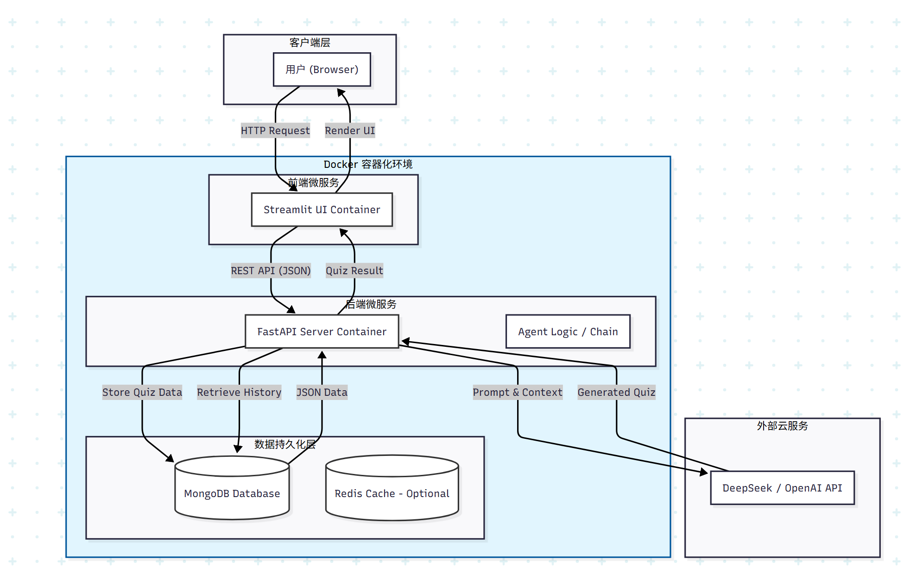

# 智能学习评估与巩固助手 (Intelligent Learning Agent)

> **2025年秋云计算期末大作业 - 命题二：学习效果评估和巩固智能体**
>
> 10235501444 朱钇霖

##  项目介绍 (Introduction)

本项目是一个基于 **云原生架构 (Cloud Native)** 与 **大语言模型 (LLM Agent)** 的智能学习辅助系统。

针对“学完新知识后缺乏客观评估手段，无法发现知识盲点”的痛点场景 ，本系统构建了一个闭环的学习评估环境。它能够根据用户上传的任意学习资料（教材、笔记等），自动分析知识点，生成针对性的考核试题，并将用户的错题与历史记录持久化存储，形成个性化的“错题本” 。

##  核心功能 (Features)

1. **智能出题 (Dynamic Quiz Generation)**:
   - 基于 RAG (检索增强生成) 技术，精准提取文本核心考点 
   - 强制输出结构化 JSON 数据，确保题目格式统一。
   - **容错机制**: 集成 Mock 数据降级策略，当 LLM API 不可用时自动切换至演示模式，防止系统崩溃 。
2. **深度解析 (Smart Evaluation)**:
   - 不仅判断对错，还利用 Agent 提供详尽的答案解析与知识点回顾 。
3. **持久化记忆 (Persistence Layer)**:
   - 集成 **MongoDB** 数据库，自动记录每一次生成的试卷 。
   - 提供“历史回溯”功能，用户可随时查看过往练习记录。
4. **云原生部署 (Cloud Native)**:
   - 全链路容器化，使用 Docker Compose 编排 Frontend、Backend、Database 微服务 。

## 系统架构 (Architecture)

本系统采用前后端分离的微服务架构，各组件通过 Docker 网络进行通信。



- **前端:** 使用 **Streamlit** 构建交互式 Web 界面。
- **后端**: 使用 **FastAPI** 提供高性能 RESTful 接口，集成 **LangChain** 进行 Agent 编排。
- **Database**: 使用 **MongoDB** 存储非结构化试题数据。

## 快速开始

### 1. 环境准备

确保本地已安装 [Docker](https://www.docker.com/) 和 [Docker Compose](https://docs.docker.com/compose/)。

### 2. 克隆项目

```
git clone https://github.com/<你的用户名>/<你的仓库名>.git
cd <你的仓库名>
```

### 3. 配置环境变量

在项目根目录创建一个 `.env` 文件，填入你的 LLM API Key（推荐使用 DeepSeek）：

```
# LLM 配置 (兼容 OpenAI 格式)
OPENAI_API_KEY=sk-xxxxxxxxxxxxxxxxxxxxxxxx  # 替换为你的 Key
OPENAI_API_BASE=https://api.deepseek.com    # 或 https://api.openai.com/v1

# 数据库配置 (Docker 内部自动解析)
MONGODB_URL=mongodb://mongo:27017
```

### 4. 启动服务

使用 Docker Compose 一键拉起所有服务：

```
docker compose up --build
```

启动成功后，访问以下地址：

- **前端界面**: [http://localhost:8501](https://www.google.com/search?q=http://localhost:8501)
- **后端 API 文档**: [http://localhost:8000/docs](https://www.google.com/search?q=http://localhost:8000/docs)

## 项目结构 (Project Structure)

```
.
├── docker-compose.yml      # 容器编排文件
├── backend/                # 后端微服务
│   ├── Dockerfile
│   ├── requirements.txt
│   └── app/
│       └── main.py         # 核心 Agent 逻辑与 API
└── frontend/               # 前端微服务
    ├── Dockerfile
    ├── requirements.txt
    └── app/
        └── main.py         # Streamlit 交互界面
```

##  团队分工 (Division of Labor)

本项目由单人独立完成