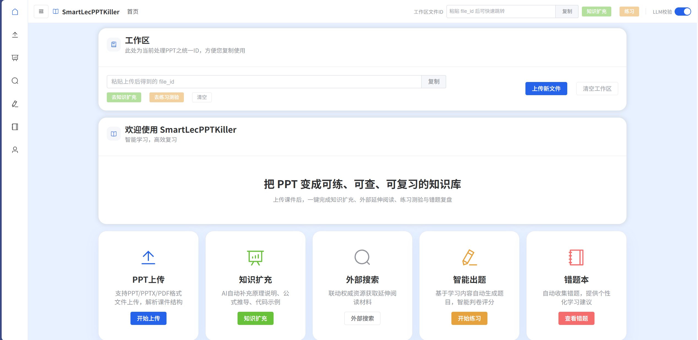

# SmartLecPPTKiller：A Smart PPT Extractor and Teaching Assistant

### 命题1 + 命题2
### 完成人：[柯宇](https://github.com/BronsonLau) | [王可楠](https://github.com/Jiu-956)
### 原仓库地址(可看开发记录)：[SmartLecPPTKiller：A Smart PPT Extractor and Teaching Assistant](https://github.com/BronsonLau/SmartLecPPTKiller-A-Smart-PPT-Extractor-and-Teaching-Assistant)
#### 项目所属组织：[中国·华东师范大学OpenEduTech实验室](https://github.com/OpenEduTech)



基于 **FastAPI + Vue 3 的云原生 PPT/PDF 学习助手**：支持文件解析（含 OCR）、知识扩充、多维外部检索、智能出题判卷、错题本与个性化“小灶纠偏”。

> 说明：后端服务对外展示名称由环境变量 `APP_NAME` 控制；默认为“PPT学习助手”。

**快速链接**

- 我们的公开服务地址：[SmartLecPPTKiller](http://47.242.28.212:8080/) 【2026.01.20-2026.02.20 基于阿里云服务器 请连接华东师范大学VPN或校园网使用】
- 本地启动后前端：http://localhost:8080
- 本地启动后后端：http://localhost:8002
- 本地OpenAPI：http://localhost:8002/docs
- 本地健康检查：http://localhost:8002/health
- 架构说明：`docs/ARCHITECTURE(简版Brief).md`
- 提交版 API 文档：`docs/API.md`
- 本地零压力搭建文档：`SETUP-MEMO.md`

## 架构流程图（摘自 docs/ARCHITECTURE(简版Brief).md）

```text
┌─────────────────────────────────────────────────────────────┐
│                         用户层                               │
│                    (Web Browser)                             │
└───────────────────────────┬─────────────────────────────────┘
                            │
┌───────────────────────────▼─────────────────────────────────┐
│                      前端层 (Frontend)                       │
│                                                               │
│  ┌──────────────┐  ┌──────────────┐  ┌──────────────┐      │
│  │   Vue 3      │  │ Element Plus │  │   Pinia      │      │
│  │   Router     │  │     UI       │  │   Store      │      │
│  └──────────────┘  └──────────────┘  └──────────────┘      │
│                                                               │
│  Container: Nginx (Container 80 / Host 8080)                 │
└───────────────────────────┬─────────────────────────────────┘
                            │ HTTP/REST API
┌───────────────────────────▼─────────────────────────────────┐
│                      后端层 (Backend)                        │
│                                                               │
│  ┌─────────────────────────────────────────────────────┐   │
│  │              FastAPI Application                     │   │
│  │  ┌──────────┐  ┌──────────┐  ┌──────────────────┐  │   │
│  │  │ API路由  │  │ 中间件   │  │  异常处理        │  │   │
│  │  └──────────┘  └──────────┘  └──────────────────┘  │   │
│  └─────────────────────────────────────────────────────┘   │
│                            │                                  │
│  ┌────────────────┬────────┴────────┬──────────────────┐   │
│  │                │                  │                   │   │
│  ▼                ▼                  ▼                   ▼   │
│  ┌──────────┐  ┌──────────┐  ┌───────────┐  ┌──────────┐  │
│  │PPT解析器 │  │知识Agent │  │ 出题Agent │  │ 判卷Agent│  │
│  └──────────┘  └──────────┘  └───────────┘  └──────────┘  │
│                                                               │
│  Container: FastAPI (Container 8000 / Host 8002)             │
└─────┬─────────────────┬──────────────────┬──────────────────┘
      │                 │                  │
      │                 │                  │
┌─────▼─────┐  ┌────────▼────────┐  ┌─────▼──────┐
│  ChromaDB │  │  DeepSeek API   │  │   Redis    │
│  向量数据库│  │   (LLM/Emb)     │  │   缓存     │
│           │  │                  │  │            │
│ Container 8000/Host 8001 │  External API  │  Host 6379  │
└───────────┘  └─────────────────┘  └────────────┘
```

## 目录

- [你能用它做什么](#你能用它做什么)
- [技术与服务编排（Docker Compose）](#技术与服务编排docker-compose)
- [快速开始（推荐：Docker）](#快速开始推荐docker)
- [本地开发](#本地开发)
- [API 速览](#api-速览)
- [仓库结构](#仓库结构)
- [常见问题](#常见问题)

---

## 你能用它做什么

### 1) PPT/PDF 解析与检索

- 语义解析：识别标题/子标题/正文/图片/备注，生成结构化 `slides` 与 `metadata.outline`
- OCR：对图片提取文字（Tesseract），并将结果用于索引与展示
- 向量检索：将解析结果写入 ChromaDB，支持语义搜索与定位知识点
- Markdown 留存：
  - `/api/ppt/parse/{file_id}` 返回 `markdown` 字段（用于网页预览与下载）
  - `/api/knowledge/expand` 返回 `markdown` 字段（用于网页预览与下载）
  - “小灶纠偏”同样返回 `markdown`（用于网页预览与下载）

### 2) 知识扩充与外部资源

- 知识扩充：调用 DeepSeek（OpenAI 兼容 SDK）输出解释/公式/代码示例/相关主题/外部资源
- 外部检索：支持 Wikipedia / Arxiv / Semantic Scholar / OpenAlex / StackExchange，Bing/Google 为可选开关
- LLM 输出校验：接口会返回 `llm_validation`（若启用），用于前端“校验抽屉”展示

### 3) 出题与判卷 + 错题闭环

- 出题：基于向量检索定位上下文后生成题目，写入 Redis 便于后续判卷/错题记录
- 判卷：支持语义相似度、对齐评分摘要与错误类型分类
- 错题本：错题聚合、统计、标记复习
- 小灶纠偏：按“精讲-对比-再练-迁移”结构生成个性化补救内容

---

## 技术与服务编排（Docker Compose）

本仓库通过根目录的 `docker-compose.yml` 编排 4 个服务：

- `frontend`：Nginx 托管 Vue 构建产物，并将 `/api/` 反代到后端（宿主机端口 `8080`）
- `backend`：FastAPI（容器内 `8000`，宿主机映射为 `8002`）
- `chromadb`：向量数据库（容器内 `8000`，宿主机映射为 `8001`）
- `redis`：缓存与错题/题目存储（宿主机 `6379`）

架构说明可见：`docs/ARCHITECTURE(简版Brief).md`。

---

## 快速开始（推荐：Docker）

### 1) 准备环境变量

仓库包含 `.env.example`，可复制为 `.env` 并按需调整：

```bash
copy .env.example .env
```

注意：

- **不要提交** 真实的 `DEEPSEEK_API_KEY` 等密钥到仓库
- 若未配置 `DEEPSEEK_API_KEY`，涉及 LLM 的功能会失败，但后端仍可启动用于基础联调（后端配置允许留空）

### 2) 启动

```bash
docker-compose up -d
```

### 3) 访问

- 前端：http://localhost:8080
- 后端（宿主机映射）：http://localhost:8002
- OpenAPI 文档：http://localhost:8002/docs
- 健康检查：http://localhost:8002/health

---

## 本地开发

更完整的本地开发/环境说明见：`docs/LOCAL_SETUP(FOR SETUP ONLY).md`。

<details>
<summary>后端（FastAPI）</summary>

```bash
cd backend
python -m venv venv
venv\Scripts\activate
pip install -r requirements.txt
uvicorn app.main:app --reload --port 8000
```

</details>

<details>
<summary>前端（Vue 3 + Vite）</summary>

```bash
cd frontend
npm install
npm run dev
```

</details>

---

## API 速览

启动后可在 `http://localhost:8002/docs` 查看 OpenAPI。

<details>
<summary>常用接口（与代码一致）</summary>

- `POST /api/ppt/upload`：上传 PPT/PPTX/PDF
- `GET /api/ppt/parse/{file_id}`：解析文件（含 `slides/metadata/markdown`）
- `GET /api/ppt/history`：获取解析历史
- `POST /api/knowledge/expand`：知识扩充（含 `markdown`）
- `GET /api/knowledge/external-search`：外部资源检索
- `GET /api/knowledge/history`：扩充历史
- `POST /api/questions/generate`：生成题目
- `POST /api/questions/evaluate`：评估答案
- `GET /api/mistakes/list`：错题列表
- `GET /api/mistakes/stats`：错题统计
- `POST /api/mistakes/{question_id}/review`：标记复习
- `POST /api/mistakes/remediate`：生成小灶纠偏（含 `markdown`）

</details>

更详细的提交版说明见：`docs/API.md`。

---

## 仓库结构

```text
.
├── docker-compose.yml
├── .env.example
├── backend/
│   ├── Dockerfile
│   ├── requirements.txt
│   └── app/
│       ├── main.py
│       ├── api/
│       ├── agents/
│       ├── core/
│       ├── models/
│       └── parsers/
├── frontend/
│   ├── Dockerfile
│   ├── nginx.conf
│   ├── package.json
│   └── src/
│       ├── views/
│       ├── components/
│       ├── api/
│       ├── stores/
│       └── router/
└── docs/
    ├── API.md
    ├── ARCHITECTURE(简版Brief).md
    └── LOCAL_SETUP(FOR SETUP ONLY).md
```

---

## 常见问题

### 1) 上传大文件失败

前端容器的 Nginx 已配置 `client_max_body_size 60m`；后端的 `MAX_UPLOAD_SIZE` 默认为 50MB。需要更大上限时请同时调整两处（见 `frontend/nginx.conf` 和 `.env/.env.example`）。

### 2) OCR 不生效

后端镜像已安装 `tesseract-ocr` 与 `tesseract-ocr-chi-sim`；OCR 是否启用由环境变量 `OCR_ENABLED` 控制（见 `.env`）。

### 3) Docker + Windows/WSL2 下源码“null bytes”问题

`docker-compose.yml` 已对后端做了源码目录 bind mount（`./backend/app:/app/app`）以规避部分环境在构建 COPY 阶段出现的异常。

## 开源政策

### 欢迎提出PULL&REQUEST

请直接在GitHub中提出~

### 欢迎联系我们

请通过Github所展示之电子邮箱进行联系~

### 欢迎合作

欢迎在此项目或其他的项目与我们进行合作或进行招募~

