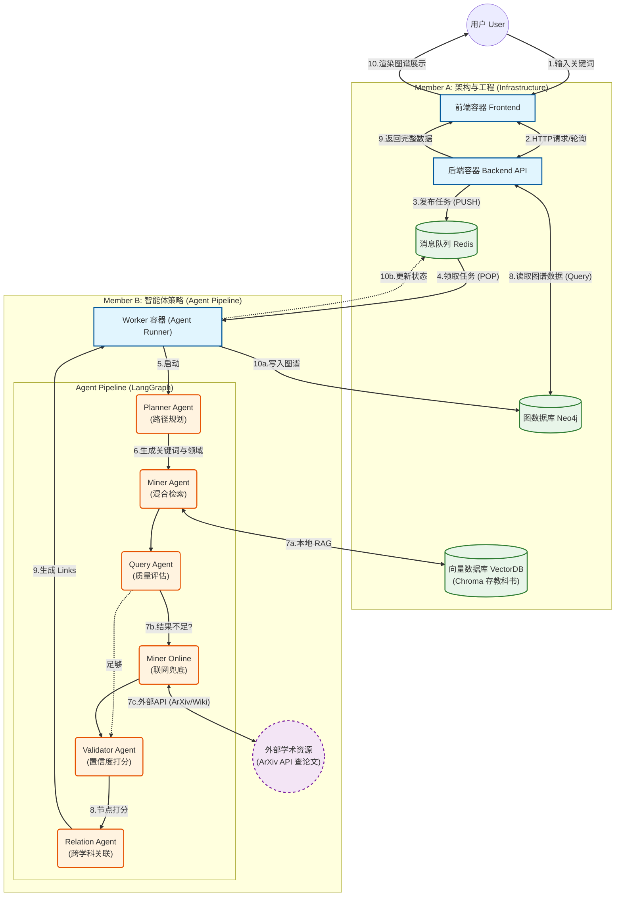

# AutoKGS: 跨学科知识图谱智能体

## 1. 项目背景与目标

**痛点场景**：
在现代教育与科研中，知识碎片化现象严重。学生难以洞察不同学科间（如神经科学与深度学习、热力学与信息论）的内在关联，导致知识体系割裂。

**核心目标**：
构建一个基于多智能体（Multi-Agent）协作的系统，自动挖掘跨领域概念的桥梁，并构建可视化的知识图谱，帮助用户发现“远亲概念”的逻辑联系。

**功能清单**：
- **深度关联挖掘**：利用智能体在不同学科领域（数学、物理、社会学等）自动寻找相关概念。
- **自动化图谱构建**：从非结构化文本中提取实体及其关系，生成标准化的图结构数据。
- **混合检索增强 (RAG + Online)**：结合本地教科书知识库（RAG）与在线学术资源（ArXiv/Wikipedia），确保知识的广度与深度。
- **交互式可视化**：提供 Web 端动态交互界面，支持力导向图的拖拽、缩放与点击跳转。
- **多视图切换**：支持**知识图谱 (Knowledge Graph)** 与 **思维导图 (Mind Map)** 两种视图模式，满足不同场景下的知识探索需求。
- **幻觉校验机制**：引入审计智能体（Auditor Agent）对生成内容进行学术引用校验，确保准确性。
- **证据与可信度呈现**：关系边展示 `desc/citation`，并以 `confidence` 强化高可信节点主干图。
- **筛选与导出**：支持 Domain/Relation/Confidence 过滤，支持导出当前图谱 JSON。
- **知识库导入**：提供工具自动扫描并导入 EPUB/MOBI 格式教科书到向量数据库。

---

## 2. 系统架构 (System Architecture)

本系统采用 **微服务架构** 与 **云原生 (Cloud-Native)** 部署方案，实现了计算、存储与表现层的完全解耦。

### 2.1 核心流程



### 2.2 技术栈概览

#### 后端与架构 (Backend & Infrastructure)
| 模块 | 技术选型 | 技术方案说明 |
| :--- | :--- | :--- |
| **API 网关** | **FastAPI** (Python) | 采用高性能 ASGI 框架，利用 `async/await` 特性处理高并发长连接，自动生成 OpenAPI 规范文档。 |
| **消息队列** | **Redis** | 引入内存级中间件实现**异步解耦**，作为任务缓冲池，确保高并发下系统的稳定性。 |
| **容器编排** | **Docker Compose** | 采用云原生部署方案，通过声明式配置管理多容器生命周期，确保环境一致性。 |

#### 前端与可视化 (Frontend & Visualization)
| 模块 | 技术选型 | 技术方案说明 |
| :--- | :--- | :--- |
| **前端框架** | **React** + **Vite** | 基于组件化架构构建单页应用 (SPA)，实现数据与视图分离，提供流畅的用户交互体验。 |
| **图谱渲染** | **Apache ECharts** | 使用高性能可视化引擎渲染大规模力导向图，支持节点的高亮、折叠与动态交互。 |
| **UI 组件库** | **Ant Design** + **Framer Motion** | 采用企业级 UI 设计语言与 Framer Motion 动画库，构建具备磨砂玻璃质感 (Glassmorphism) 与流畅动效的沉浸式界面。 |

#### 智能体 (Agent System)
| 模块 | 技术选型 | 技术方案说明 |
| :--- | :--- | :--- |
| **Agent 编排** | **Custom Workflow** | 采用线性工作流 + 并发执行（Planner → Miner/MinerOnline → Validator → Relation）架构，支持多线程并发检索。 |
| **大模型支持** | **ECNU-LLM / Kimi** | 支持接入 ECNU 校内 LLM 或 Moonshot AI (Kimi) API 进行语义理解与生成。 |
| **图数据库** | **Neo4j** | 使用原生图数据库存储知识实体及其拓扑结构，利用 Cypher 语言高效执行多跳查询。 |
| **RAG 检索** | **ChromaDB** | 部署本地向量数据库支持 **RAG (检索增强生成)**，对教科书进行高维向量索引，弥补模型知识盲区。 |

---

## 3. 快速开始 (Quick Start)

本项目基于 Docker 构建，可实现一键部署。

### 前置要求
- Docker Desktop 或 Docker Engine
- Docker Compose

### 启动步骤

1. **克隆项目**
   ```bash
   git clone <repository_url>
   cd AutoKGS
   ```

2. **配置环境变量**
   在 `agent_engine` 或根目录下创建 `.env` 文件（或修改 `docker-compose.yml` 中的环境变量）：
   ```bash
   # --- 基础配置 ---
   # Neo4j
   NEO4J_URI=bolt://neo4j:7687
   NEO4J_USER=neo4j
   NEO4J_PASSWORD=password
   
   # Redis
   REDIS_HOST=redis
   REDIS_PORT=6379
   
   # ChromaDB
   CHROMA_SERVER_HOST=chromadb
   CHROMA_SERVER_PORT=8000
   
   # --- LLM 配置 (二选一) ---
   # 1. ECNU LLM
   LLM_API_KEY=your_ecnu_api_key
   LLM_API_BASE=https://api.ecnu.edu.cn/v1
   EMBEDDING_MODEL=ecnu-embedding-small
   
   # 2. Kimi (Moonshot AI)
   KIMI_API_KEY=sk-xxxxxxxx
   ```

3. **启动服务**
   ```bash
   docker-compose up --build -d
   ```

4. **访问服务**
   - **前端界面**: [http://localhost:5173](http://localhost:5173)
   - **后端 API**: [http://localhost:8000/docs](http://localhost:8000/docs)
   - **Neo4j 控制台**: [http://localhost:7474](http://localhost:7474)
   - **ChromaDB**: [http://localhost:8001](http://localhost:8001)

### 数据导入

这是教科书数据：

通过网盘分享的文件：data.7z
链接: https://pan.baidu.com/s/1aOxGAS_UwNEWgix-l9Y4wA?pwd=6ju3 提取码: 6ju3

如果需要导入本地教科书以增强 RAG 能力：

1. 将 `.epub` 或 `.mobi` 格式的电子书放入 `./data` 目录。
2. 运行导入脚本：
   ```bash
   # 进入 worker 容器
   docker compose exec worker bash
   
   # 运行导入工具
   python -m tools.ingest_books
   ```

---

## 4. 项目结构

```Plaintext
AutoKGS/
├── docker-compose.yml          # [核心] 容器编排配置
├── README.md                   # 项目文档
├── .env                        # 环境变量
├── .gitignore                        
│
├── frontend/                # [服务1] 前端容器 (React + Vite)
│   ├── Dockerfile
│   ├── src/
│   │   ├── components/
│   │   ├── api/
│   │   ├── useGraphOption.js   # 图谱配置
│   │   ├── useMindMapOption.js # 思维导图配置
│   │   └── App.jsx
│   └── ...
│
├── backend/                 # [服务2] 后端 API 容器 (FastAPI)
│   ├── Dockerfile
│   ├── main.py                 # FastAPI 入口
│   ├── routers/                # 路由定义 (Task, Graph)
│   └── database/               # 数据库连接工具
│
├── agent_engine/            # [服务3] 智能体 Worker 容器 (Python)
│   ├── Dockerfile              
│   ├── worker_main.py          # Worker 主程序 (监听 Redis)
│   ├── workflow.py             # Agent 工作流编排
│   ├── config.py               
│   │
│   ├── agents/              # 智能体实现
│   │   ├── planner.py          # 规划 Agent
│   │   ├── miner.py            # 挖掘 Agent (RAG)
│   │   ├── miner_online.py     # 联网 Agent
│   │   ├── query.py            # 质检 Agent
│   │   ├── validator.py        # 验证 Agent
│   │   └── relation.py         # 关系 Agent
│   │
│   ├── tools/               # 工具链
│   │   ├── ingest_books.py     # 图书导入工具
│   │   ├── ecnu_llm.py         # LLM 封装
│   │   ├── search_arxiv.py     # ArXiv 工具
│   │   └── rag_retriever.py    # RAG 检索器
│   │
│   └── prompt/              # Prompt 模板
│
├── neo4j_data/              # Neo4j 数据持久化
├── chroma_data/             # ChromaDB 数据持久化
└── redis_data/              # Redis 数据持久化
```

## 5. 数据交互格式

### 任务状态 (Redis)
后端轮询 `task:{uuid}` 获取实时进度：

```json
{
  "status": "PROCESSING",
  "step_index": 2,       
  "progress": 45,
  "message": "正在并行检索 (1/4)..."
}
```

### 图数据结构 (Neo4j -> Frontend)
```json
{
  "nodes": [
    {
      "id": "UUID",
      "label": "熵",
      "group": "Natural_Sciences",
      "source_type": "textbook", 
      "confidence": 0.98,
      "info": "..."
    }
  ],
  "links": [
    {
      "source": "UUID_A",
      "target": "UUID_B",
      "relation": "RELATED_TO",
      "citation": "Source A; Source B"
    }
  ]
}
```

### Redis格式：

#### 任务发布：

```json
{
  "task_id": "550e8400-e29b-41d4...", //UUID，唯一凭证
  "keyword": "熵",                    // 用户输入
  "params": {                         // (可选) 额外参数
    "depth": 3,                       // 搜索深度
    "language": "zh"
  },
  "created_at": 1709876543
}
```

### 任务状态格式：
*存入 Redis Key-Value (Key: `task:550e8400...`)* 后端接口会不断轮询读取这个 Key。

#### 1. 状态流转定义 (Step Definitions)
前端根据 `step_index` (0-4) 展示不同的加载动画步骤。后端需按照以下阶段更新 Redis：

| Step | Status | Progress | Message (示例) | 说明 |
| :--- | :--- | :--- | :--- | :--- |
| **0** | PROCESSING | 5 | "任务已发送至 Redis 队列..." | 初始状态，等待 Worker 领取 |
| **1** | PROCESSING | 20 | "AI Worker (Agent) 已接单..." | Worker 开始执行 |
| **2** | PROCESSING | 45 | "正在检索 ArXiv 和教科书..." | Miner Agent 进行混合检索 |
| **3** | PROCESSING | 70 | "正在提取实体与关系..." | LLM 阅读文本并抽取知识 |
| **4** | PROCESSING | 90 | "图谱构建完成，正在渲染..." | 校验通过，写入 Neo4j |
| **5** | SUCCESS | 100 | "Completed" | 任务彻底完成，返回结果 |

#### 2. JSON 示例

**进行中 (Processing):**
```json
{
  "status": "PROCESSING",
  "step_index": 2,       
  "progress": 45,
  "message": "正在检索 ArXiv 和教科书..."
}
```

**成功 (Success):**
```json
{
  "status": "SUCCESS",
  "step_index": 5,
  "progress": 100,
  "result_node_id": "Entropy", // 告诉后端去 Neo4j 查哪个主节点
  "message": "Completed",
  "completed_at": 1709876599
}
```

**失败 (Failed):**
```json
{
  "status": "FAILED",
  "error": "搜索超时，请稍后重试"
}
```

