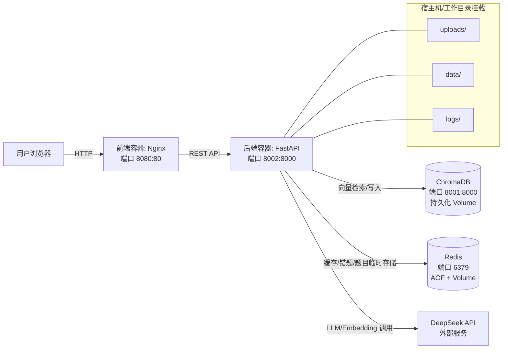

# SmartLecPPTKiller 技术文档

## 2026-01

### GitHub仓库：[LecPPTKiller-Smart_PPT_Extractor-Quiz_Maker](https://github.com/BronsonLau/LecPPTKiller-Smart_PPT_Extractor-Quiz_Maker)

#### 小组成员：柯宇 10235501461 | 王可楠 10235501466


---

## 1. 架构设计

### 1.1 系统架构图

（说明：系统通过 Docker Compose 编排多个容器；前端为 Nginx 静态站点容器，后端为 FastAPI 容器；Redis 用于缓存/错题等数据存取；ChromaDB 用于向量检索；LLM 通过 DeepSeek API 以外部服务方式调用。）



### 1.2 使用到的云原生组件与工程化要点

#### 1) Docker / Docker Compose（已使用）

- 多容器编排：见 `docker-compose.yml`
  - `frontend`：构建后由 Nginx 提供静态资源服务（对外 `8080:80`）
  - `backend`：FastAPI 应用（对外 `8002:8000`）
  - `chromadb`：ChromaDB 向量数据库（对外 `8001:8000`，持久化卷 `chromadb-data`）
  - `redis`：Redis 7（对外 `6379:6379`，AOF 开启，持久化卷 `redis-data`）
- 健康检查：
  - 前端容器：`HEALTHCHECK` 探测 `http://localhost/`
  - 后端容器：`HEALTHCHECK` 探测 `http://localhost:8000/health`
- 运行期挂载（backend bind mount）：在 `docker-compose.yml` 中将 `backend/app`、`uploads`、`data`、`logs` 以 volume 形式挂载到容器内部，保证容器运行时读取到真实源码与数据目录。

#### 2) Redis（已使用）

- 作为缓存/存储支撑组件，供后端服务使用（见 `docker-compose.yml` 的 `REDIS_HOST/REDIS_PORT` 环境变量配置）。
- 开启 AOF（appendonly）以提升数据持久化能力（`redis-server --appendonly yes`）。

#### 3) 向量数据库 ChromaDB（已使用）

- 作为语义检索组件（RAG 的检索层），供后端服务连接（见 `docker-compose.yml` 的 `CHROMA_HOST/CHROMA_PORT` 配置）。
- 数据持久化由 Docker volume `chromadb-data` 提供。

#### 4) 微服务 / Serverless / K8S（现状说明）

- 服务拆分：当前实现为“多服务容器拆分”（前端/后端/向量库/缓存），由 Docker Compose 统一编排。
- K8S（Kubernetes）：仓库内未包含 K8S manifests（如 Deployment/Service/Ingress），未落地在 K8S 上运行。
- Serverless：仓库内未包含函数式部署（如云函数/Function App）相关实现。

### 1.3 LLM Agent 工具链（实现形态）

系统的智能能力通过后端的多个 Agent/模块协作完成，核心工具链如下：

- LLM/Embedding 接入：使用 OpenAI SDK 兼容接口（`AsyncOpenAI`），通过 `settings.deepseek_api_base` 指向 DeepSeek API（见 `backend/app/core/config.py`）。
- 结构化输出：关键链路使用 `response_format={"type": "json_object"}` 强制 JSON 输出，减少解析歧义（见多个 Agent 与目录概括代码）。
- 重试与降级：
  - 多处 LLM 调用实现重试机制（如 `KnowledgeExpansionAgent._call_llm`）。
  - JSON 提取失败或字段缺失时，采取降级策略保证接口可用（如知识扩充解析、纠偏解析）。
- 幻觉风险控制与校验：
  - 后端提供统一的 LLM 输出校验工具 `backend/app/core/llm_validation.py`，对题目生成、判卷结果、知识扩充、目录概括等输出生成 `valid/issues/warnings/raw_preview` 报告。
  - 判卷链路额外引入“语义相似度阈值”兜底，降低“答非所问但得分较高”的风险（见 `ANSWER_SIMILARITY_THRESHOLD` 与 `_compute_similarity` 相关逻辑）。
- 文档解析/OCR：
  - PPTX：`python-pptx` 解析结构与图片；图片 OCR 使用 `pytesseract`。
  - PDF：`PyMuPDF (fitz)` 提取文本与图片，并可对整页渲染 OCR。
  - OCR 依赖由后端 Dockerfile 在系统层安装 `tesseract-ocr` 和 `tesseract-ocr-chi-sim`。

---


## 2. 分工说明

以下分工与贡献比例来自前端“项目组介绍”页面（`frontend/src/views/TeamView.vue`）中明示信息。

| 成员 | 学号 | 贡献比例 | 主要负责模块（按仓库已有实现表述） |
|---|---:|---:|---|
| 柯宇 | 10235501461 | 50% | LLM Agent 设计与智能逻辑实现；PPT 内容理解相关 Agent；知识扩展/RAG Agent；DeepSeek API 调用；向量化与检索逻辑；Prompt 设计与优化；前端界面优化；项目统筹测试与最终细节调优；上云部署 |
| 王可楠 | 10235501466 | 50% | 系统架构设计与前后端工程实现；FastAPI 后端工程；Vue3 前端工程；Docker 容器化与部署；前后端接口设计；DEMO 视频剪辑；最终交叉测试；上云辅助 |

---


## 3. 开发流程

#### 因为我们的开发过程比较密集，基本实现了1-2天的集中开发，因此Github的上传记录是比较集中的。

#### 并且我们有的时候是互相上传和统一上传，实际上传者和具体实现者不一定是同一个人，以本技术文档为准。

#### COMMIT记录详见我们的github仓库。


### 整体开发流程如下：

### 阶段 A：工程骨架与可启动

#### A1（王可楠）— 初始化后端可启动骨架

上传内容（按目录）：

- `backend/app/main.py`
- `backend/app/core/`（包含配置与数据库连接相关：`config.py`、`database.py`）
- `backend/app/models/schemas.py`
- `backend/app/api/`
- `backend/requirements.txt`

验收：本地运行 `uvicorn app.main:app --port 8000` 后，`GET /health` 与 `GET /docs` 正常。

#### A2（王可楠）— 初始化 Docker Compose 可启动

上传内容：

- `docker-compose.yml`
- `backend/Dockerfile`
- `frontend/Dockerfile`
- `frontend/nginx.conf`

验收：`docker-compose up -d --build` 能拉起容器；后端容器 healthcheck 不报错；前端容器能提供静态站点。

#### A3（两人协作）— 首版说明文档

上传内容：

- `README.md`
- `docs/LOCAL_SETUP.md`
- `docs/ARCHITECTURE.md`

验收：README 中的启动步骤与实际端口一致（前端 8080、后端宿主机 8002）。

---

### 阶段 B：PPT/PDF 解析与索引链路

#### B1（王可楠）— 解析 API 与解析器

上传内容：

- `backend/app/api/ppt.py`
- `backend/app/parsers/ppt_parser.py`

验收：

- `POST /api/ppt/upload` 返回 `file_id`
- `GET /api/ppt/parse/{file_id}` 返回 `slides` 与 `metadata`

#### B2（柯宇）— 解析增强：OCR 与目录概括（基于现有开关）

上传内容：

- `backend/app/parsers/ppt_parser.py`（OCR 文本抽取、图片语义解说、`outline_summary` 目录概括逻辑）
- `backend/app/core/config.py`（OCR/目录概括相关开关与 DeepSeek base_url 规范）

验收：开启 `.env` 中 `OCR_ENABLED=true` 后，解析结果中 `ocr_texts`/图片描述更丰富；`metadata` 中出现 `outline`，并可出现 `outline_summary`。

---

### 阶段 C：RAG 检索与知识扩充

#### C1（柯宇）— 知识扩充 Agent（LLM + 结构化 JSON 输出）

上传内容：

- `backend/app/agents/knowledge_agent.py`
- `backend/app/core/llm_validation.py`
- `backend/app/models/schemas.py`（如需增加 `llm_validation` 字段）

验收：单测不强制，但 `/api/knowledge/expand` 能返回结构化 `KnowledgeExpansion`。

#### C2（王可楠）— 知识扩充 API + 历史记录

上传内容：

- `backend/app/api/knowledge.py`

验收：

- `POST /api/knowledge/expand` 能返回 `expansion/formulas/code_examples/related_topics`
- `GET /api/knowledge/history` 能返回历史列表（Redis）

---

### 阶段 D：出题与判卷

#### D1（柯宇）— 出题/判卷 Agent（Prometheus Rubric + 语义相似度兜底）

上传内容：

- `backend/app/agents/question_agent.py`
- `backend/app/models/schemas.py`（`AnswerEvaluation`、`GenerateQuestionsResponse` 等字段保持一致）

验收：

- 主观题评估中返回 `alignment_score/alignment_summary`（如 LLM 正常返回）
- 相似度低于阈值时会追加“疑似答非所问”的提示

#### D2（王可楠）— 题目 API 与 Redis 缓存

上传内容：

- `backend/app/api/questions.py`

验收：

- `POST /api/questions/generate` 返回题目列表
- `POST /api/questions/evaluate` 能从 Redis 取题并返回评估

---

### 阶段 E：错题本与小灶纠偏

#### E1（柯宇）— 纠偏 Agent（精讲-对比-再练-迁移 + Markdown）

上传内容：

- `backend/app/agents/remediation_agent.py`
- `backend/app/models/schemas.py`（`RemediationResponse` 包含 `markdown`）

验收：`/api/mistakes/remediate` 返回 JSON 且包含 `markdown` 字段。

#### E2（王可楠）— 错题本 API

上传内容：

- `backend/app/api/mistakes.py`

验收：

- `GET /api/mistakes/list` 返回错题
- `POST /api/mistakes/remediate` 返回纠偏内容

---

### 阶段 F：前端页面与联调

> 前端以“页面可演示”为最小闭环，每个页面改动都要对应后端接口。

#### F1（王可楠）— 前端基础框架与路由

上传内容：

- `frontend/index.html`
- `frontend/package.json`
- `frontend/vite.config.js`
- `frontend/src/main.js`
- `frontend/src/router/`
- `frontend/src/api/`（`client.js` 与接口封装）
- `frontend/src/components/`（壳组件：Header/SideNav/Shell 等）

验收：`npm run dev` 能打开页面，且请求走 `/api` 代理。

#### F2（柯宇）— 关键页面联调与体验增强

上传内容（按页面）：

- `frontend/src/views/UploadView.vue`（上传解析展示、历史）
- `frontend/src/views/KnowledgeView.vue`（知识扩充与历史）
- `frontend/src/views/PracticeView.vue`（出题与判卷展示）
- `frontend/src/views/MistakesView.vue`（错题与小灶）
- `frontend/src/stores/workspace.js`（user_id 与全局状态）

验收：前端主链路可演示：上传→解析→扩充→出题→判卷→错题→小灶。

---

### 阶段 G：提交版文档与演示材料

> 这一阶段的提交以“可评分、可复盘”为目标，文档必须与实际代码一致。

#### G1（两人协作）— 文档归档

上传内容：

- `docs/API.md`（若保持为通用文档）
- `提交版技术文档.md`
- `提交版API文档.md`
- `提交版GitHub仓库配置操作步骤.md`
- `README.md`（更新：确保启动步骤、端口、功能点与当前实现一致）

验收：所有文档内容与路由/端口/开关一致，不出现真实 Key。

---


## 4. 智能体策略（Prompt 模板 + Agent 设计过程 + 工具链）

### 4.1 Agent 组成与职责映射

后端 Agent 主要位于 `backend/app/agents/`：

- `KnowledgeExpansionAgent`（知识扩充）：输入知识点与上下文，输出结构化解释/公式/代码/延伸主题，并可聚合外部权威资源。
- `QuestionGenerationAgent`（出题）：基于上下文生成题目，约束题型/难度/JSON 输出。
- `AnswerEvaluationAgent`（判卷）：选择题规则判分；主观题使用 LLM 打分并做错误类型分类，同时引入语义相似度兜底。
- `RemediationAgent`（小灶纠偏）：按“精讲-对比-再练-迁移”结构生成补救内容，并额外生成 Markdown 便于前端展示/下载。

此外，解析模块 `backend/app/parsers/ppt_parser.py` 也包含两类“LLM 辅助策略”：

- OCR 文本语义解说（将 OCR 文本压缩为一句话，便于检索与阅读）。
- 目录概括（将 PPT 页标题目录概括为 3-8 条主题要点）。

### 4.2 Prompt 设计过程（以“约束优先、结构化输出、可审计”为原则）

本项目的 Prompt 设计遵循以下工程化流程：

1) 先定义输出契约（JSON Schema 形态），要求“仅输出 JSON”，并在 API 调用中启用 `response_format=json_object`。
2) 对关键任务加入约束与护栏：
   - 出题链路提供“严格基于上下文、禁止引入上下文之外的新知识”的开关。
   - 判卷链路引入 Prometheus 评分法（Rubric + 逐点对照 + 可审计摘要），并显式要求“不输出完整思维链”。
3) 增加可观测的质量信号：通过 `llm_validation` 统一产出 `valid/issues/warnings/raw_preview`，使前端能提示风险。
4) 对不可控输出提供降级策略：JSON 解析失败时仍能返回基本结构，避免业务链路中断。

### 4.3 关键 Prompt 模板摘录（以仓库代码为准）

以下为仓库内真实 Prompt 的“关键片段摘录”，用于展示策略与约束。

#### 1) 知识扩充 Prompt（CoT 步骤提示 + JSON 输出）

来源：`backend/app/agents/knowledge_agent.py` 的 `_build_expansion_prompt`。

```text
你是一个专业的教学助手，擅长扩充和解释知识点。
...
要求：
1. 提供清晰的原理说明、元知识解释和背景知识
2. 如果涉及公式，给出完整的公式推导
3. 如果适用，提供代码示例（Python优先）
...
请按以下JSON格式返回（仅输出JSON，不要输出额外文字）：
{ "explanation": ..., "formulas": ..., "code_examples": ..., "related_topics": ... }

思考步骤：
1. 分析知识点的核心概念
2. 确定需要的背景知识
3. 构建逻辑清晰的解释
4. 验证内容的准确性
5. 组织输出格式
```

要点：通过“思考步骤”引导推理过程，但最终输出严格约束为 JSON，避免前端/后端解析不稳定。

#### 2) 出题 Prompt（严格上下文护栏 + 题型/难度约束 + JSON 输出）

来源：`backend/app/agents/question_agent.py` 的 `_build_generation_prompt`。

```text
约束：
必须严格基于以下上下文出题，禁止引入上下文之外的新知识
...
要求：
1. 题目类型：...
2. 难度分布：...（均匀分布）
3. 题目应覆盖核心知识点
4. 每道题都要有详细解析
5. 选择题必须有4个选项（A、B、C、D）
...
请按以下JSON格式返回（仅输出JSON，不要输出额外文字）：
{ "questions": [ { ... } ] }
```

要点：将“上下文约束”上升为显式护栏，降低无依据扩写。

#### 3) 判卷 Prompt（Prometheus 评分法 + 错误类型分类 + 不输出完整思维链）

来源：`backend/app/agents/question_agent.py` 的 `_build_evaluation_prompt`。

```text
Prometheus评分法：
1) 明确评分量表（Rubric）
2) 对照参考答案与学生答案进行逐点比对
3) 输出可审计的评分摘要（不输出完整思维链）
...
评分标准（Rubric）：
1. 完整性（40%）...
2. 准确性（40%）...
3. 表达性（20%）...

要求：
- 进行错误类型分类：概念错 / 计算错 / 理解偏差 / 答非所问 / 其他
- 给出推理对齐评分（0-100）与简述，不输出完整推理链
...
输出JSON格式：
{ "score": ..., "error_type": ..., "alignment_score": ..., "alignment_summary": ... }
```

要点：通过 Rubric 结构与“对齐摘要”来提升可解释性，同时明确禁止输出完整思维链。

#### 4) 小灶纠偏 Prompt（固定教学结构 + JSON 输出 + Markdown 转换）

来源：`backend/app/agents/remediation_agent.py` 的 `_build_prompt`。

```text
请进行个性化纠偏，遵循“精讲-对比-再练-迁移”的结构。
...
要求：
1) 精讲：用不同于PPT的方式重新讲解
2) 对比：指出正确理解 vs 错误理解
3) 再练：给1道针对该错因的练习题（含标准答案与解析）
4) 迁移：给1道相似但不同题（含标准答案与解析）
5) 输出JSON
```

要点：Prompt 固定教学法结构，后端将 JSON 再转换为 Markdown（`_to_markdown`），前端可直接渲染与下载。

#### 5) 目录概括 Prompt（结构化摘要 + JSON 输出）

来源：`backend/app/parsers/ppt_parser.py` 的 `_summarize_outline`。

```text
你是课程助教。请将以下PPT目录概括为3-8条主题要点：
...
输出JSON格式（仅输出JSON）：
{"summary": ["主题1", "主题2", "主题3"]}
```

#### 6) OCR 语义解说 Prompt（短句约束）

来源：`backend/app/parsers/ppt_parser.py` 的 `_describe_image_semantics`。

```text
你是文档理解助手。请基于OCR文本给出图片语义解说，要求简短、准确。
...
输出要求：
- 20~60字
- 只输出一句话
```

### 4.4 关键工具链联动（RAG + 校验 + 兜底）

- RAG 检索层：PPT 解析内容向量化后进入 ChromaDB，用于知识扩充/出题等场景的上下文定位（具体向量库调用在后端模块中完成）。
- 判卷兜底：主观题在 LLM 评分前后结合“语义相似度”判断，若相似度低于阈值（`ANSWER_SIMILARITY_THRESHOLD`），强制提示“疑似答非所问”。
- 校验层：`backend/app/core/llm_validation.py` 为多种输出提供统一质量报告，前端可据此展示风险提示。

---


## 5. 项目优势（云原生组件合理性、稳定性/扩展性、Prompt 工程与事实准确性）

### 5.1 云原生组件使用的合理性

- 容器化与可复现：前后端、Redis、ChromaDB 统一由 Docker Compose 编排，依赖与运行环境可复现，便于演示与交付。
- 职责拆分清晰：前端只负责展示与交互；后端作为统一业务入口；Redis/ChromaDB 作为独立基础服务，符合“计算与数据服务分离”的工程实践。

### 5.2 稳定性与可用性设计（强调大模型幻觉风险）

- 幻觉风险显式对抗：
  - 出题提供“严格基于上下文”护栏，减少无依据扩写。
  - 判卷采用 Rubric + 对齐摘要，降低主观随意性。
- 校验与可审计：
  - `llm_validation` 输出 `issues/warnings`，让系统能提示“本次输出可能存在风险点”。
- 重试与降级：
  - LLM 调用失败具备重试（如知识扩充模块）。
  - JSON 解析失败时降级返回，保证 API 可用。
- 语义相似度兜底：主观题引入相似度阈值，低相似度强制提示并修正正确性判断，降低“答非所问”误判。

### 5.3 扩展性与演进空间（基于现有实现可自然扩展）

- 配置开关与可插拔：外部检索开关（Wikipedia/Arxiv/Semantic Scholar/OpenAlex/StackExchange/Bing/Google CSE）、OCR 开关、目录概括开关、LLM 校验开关等均集中在配置中，便于按场景裁剪。
- Agent 可扩展：`backend/app/agents/` 以独立 Agent 类封装，可新增更多 Agent（如学习路径规划/知识图谱生成）而不影响现有链路。
- 部署可演进：当前为 Docker Compose；若后续需要弹性伸缩，可在不改业务逻辑的前提下演进至 K8S（仓库当前未包含 K8S 配置，故此处仅为演进方向说明）。

### 5.4 Prompt 工程严谨性与推理链路表达

- 结构化输出优先：多个链路要求“仅输出 JSON”，并在 API 层强制 `json_object`，减少后处理不确定性。
- Rubric 驱动判卷：Prometheus 评分法将评分过程标准化，提升一致性与可解释性。
- CoT 使用方式克制：知识扩充 Prompt 中存在“思考步骤”引导，但输出严格为 JSON；判卷 Prompt 明确要求“不输出完整思维链”，以“alignment_summary”提供可审计摘要。

---


## 附：与本文档相关的关键实现文件索引

- 部署编排：`docker-compose.yml`
- 后端配置：`backend/app/core/config.py`
- LLM 输出校验：`backend/app/core/llm_validation.py`
- PPT 解析与 OCR/目录概括：`backend/app/parsers/ppt_parser.py`
- 知识扩充 Agent：`backend/app/agents/knowledge_agent.py`
- 出题与判卷 Agent：`backend/app/agents/question_agent.py`
- 小灶纠偏 Agent：`backend/app/agents/remediation_agent.py`
- 团队分工来源页面：`frontend/src/views/TeamView.vue`
