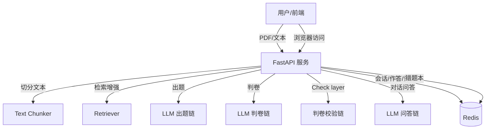
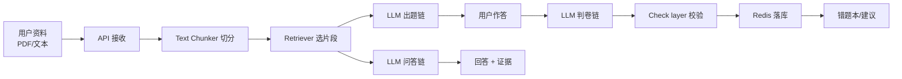
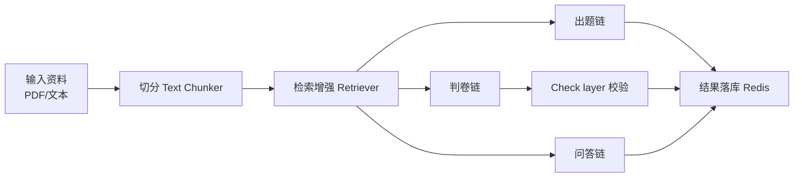

# 技术文档：学习效果评估与巩固智能体（命题二）

> 所有关键点均与课程要求对齐，并在本文档中逐条展开说明。

---

## 1. 需求与痛点场景

### 1.1 痛点场景（学习评估缺失）
**痛点场景**：学生学完新知识后缺乏客观评估手段，无法发现自身知识盲点。  
在传统学习流程中，学生往往依赖自我感觉或少量练习来判断掌握程度，但这会带来以下问题：
- **主观性强**：学习者容易高估自己对知识点的理解程度，尤其在概念性内容上。
- **覆盖不均衡**：复习过程中可能只集中在熟悉内容，忽视关键但薄弱的部分。
- **反馈滞后**：缺乏及时的客观反馈，导致错误模式长期存在。
- **缺少纠偏路径**：即使知道自己错了，也很难迅速定位“错在哪一类知识点”。

### 1.2 核心目标
**核心目标**：构建一个能基于学习资料自动出题、判卷并进行个性化纠偏的闭环系统。  
闭环的关键在于“自动化 + 可追溯 + 可迭代”，本系统通过以下机制实现：
1. **输入资料解析**：将教材内容转换为结构化知识片段，保证后续可检索与引用。
2. **自动评估生成**：根据资料自动生成不同难度的题目，形成梯度评估。
3. **判卷与解释**：不仅判定对错，还要解释原因，形成学习反馈闭环。
4. **错题沉淀**：收集高频错误并形成个性化纠偏建议，指导针对性复习。
5. **对话式问答**：允许学生对材料进行问答式探究，强化理解。

### 1.3 输入与输出范围
**输入支持**：
- PDF 教材（标准教材格式）
- 文本笔记（课堂总结、笔记）
- 录音转写文本（以“文本输入”形式实现）

**输出效果**：
- 自动生成选择题与简答题
- 判卷结果包含对错与详细解析
- 错题进入错题本并生成“小灶”建议
- 对话式问答，支持用户针对教材内容提问

### 1.4 需求映射到系统功能
- **评估缺失** → 自动出题与判卷
- **盲点难定位** → 错题本统计 + 针对性建议
- **理解不深入** → 对话式问答 + 证据引用
- **学习不可追溯** → Redis 持久化会话与答题记录

---

## 2. 架构设计

### 2.1 系统架构图（Mermaid）


### 2.2 云原生组件说明

**Docker / docker-compose**
- **作用**：将 API 服务与 Redis 打包为容器，通过编排一键部署。
- **为什么云原生**：避免“单脚本运行”，确保服务与存储分离、可扩展、可迁移。
- **体现点**：项目依赖 `Dockerfile` 与 `docker-compose.yml`，可直接部署在标准容器环境中。
- **稳定性**：Docker 使得运行环境一致，减少本地环境差异导致的运行失败。
- **扩展性**：支持后续拆分为多容器或微服务结构。

**Redis（持久化记忆）**
- **作用**：存储会话题目、作答记录、判卷结果、错题本。
- **价值**：保证用户学习状态可持续保存，即使服务重启也能恢复。
- **扩展性**：可替换为 MongoDB 等存储而不影响业务逻辑。
- **性能优势**：Redis 读写速度快，适合高频查询（如会话切换时的题目加载）。

**FastAPI（工程架构核心）**
- **作用**：提供 REST API，承载业务流程编排。
- **价值**：清晰的路由结构与数据模型规范，便于后续拆分微服务或扩展功能。
- **可维护性**：利用 Pydantic 进行数据校验，减少接口参数错误。

**实现路径与代码定位（节选）**  
- **API 入口**：`app/main.py`  
```python
app = FastAPI(title="学习评估与巩固智能体", version="0.1.0")
app.mount("/static", StaticFiles(directory=STATIC_DIR), name="static")
```
- **容器镜像**：`Dockerfile`  
```dockerfile
FROM python:3.11-slim
COPY requirements.txt /app/requirements.txt
RUN pip install --no-cache-dir -r /app/requirements.txt
```
- **编排入口**：`docker-compose.yml`  
```yaml
services:
  api:
    build: .
    ports: ["8000:8000"]
  redis:
    image: redis:7-alpine
```
- **全局配置**：`app/core/config.py`  
```python
class Settings(BaseModel):
    llm_api_key: str = os.getenv("LLM_API_KEY", "")
    redis_url: str = os.getenv("REDIS_URL", _default_redis_url())
    max_upload_mb: int = int(os.getenv("MAX_UPLOAD_MB", "20"))
```

### 2.3 数据流向

**数据流向示意图（Mermaid）**  


**流程描述**  
1. **用户提交资料**：上传 PDF 或粘贴文本，作为知识输入。  
2. **文本切分**：API 将内容切分为片段（Text Chunker），形成可检索单元。  
3. **检索增强**：Retriever 挑选与任务相关的片段作为上下文。  
4. **出题生成**：LLM 出题链生成题目与 evidence 证据片段。  
5. **作答触发判卷**：用户提交答案后进入判卷链路。  
6. **Check layer 校验**：对判卷结果进行一致性校验与纠错。  
7. **结果落库**：题目、作答、判卷结果写入 Redis。  
8. **错题沉淀**：错题写入错题本并生成个性化建议。  
9. **对话问答**：基于片段回答问题，并返回证据摘要。  


### 2.4 稳定性与扩展性设计
**稳定性**
- 上传大小限制，防止资源占用过高。  
- JSON 校验与重试机制，确保模型输出可解析。  
- Check layer 校验纠错，避免判卷逻辑漂移。  
- 出题/判卷失败有日志记录，便于排查。  
- Redis 持久化减少宕机影响。  

**扩展性**
- 多会话并存，支持不同教材。  
- 既支持 PDF，也支持文本输入。  
- 检索模块可升级为向量数据库或外部知识库。  
- 可扩展为多学科题库与统一学习平台。  

---

## 3. 智能体策略（Prompt 工程 + 工具链）

### 3.1 工具链设计
```
输入资料 → 切分 → 检索增强 → 出题/判卷/问答 → Check layer → 结果落库
```

**工具链示意图（Mermaid）**  


**解释**：
- **切分（Text Chunker）**：将长文本拆成带编号的片段，解决模型上下文长度限制问题；同时为检索提供最小颗粒度单元，便于后续定位证据来源。切分后的片段包含 `chunk_id` 与正文，保证每个知识点都可被引用与追溯。  
- **检索增强（Retriever）**：在出题、判卷、问答前，先从所有片段中筛选最相关的若干段落作为上下文输入。这样可避免模型在无关内容上“自由发挥”，并显著降低幻觉概率。对于判卷环节，检索会同时考虑题干与标准答案，让校验基于更贴近考点的片段。  
- **出题 / 判卷 / 问答链路**：  
  - **出题链路**：基于检索上下文生成选择题与简答题，并强制输出 `evidence` 证据字段，保证题目依据可追溯。  
  - **判卷链路**：对学生答案进行评分并输出解析，结果统一为结构化 JSON，便于系统处理。  
  - **问答链路**：对用户自然语言问题进行回答，并提供证据摘要，保证回答与资料一致。  
- **Check layer（二次校验）**：对判卷结果进行一致性检查，特别是选择题答案是否在选项内、评分是否与答案匹配。若发现不一致，则自动纠偏，保证公平性与稳定性。  
- **结果落库（Redis）**：将题目、作答、判卷、错题写入 Redis。落库后可实现会话切换、错题统计与长期记忆复用，也使得演示与复现更可靠。  

**关键实现路径与代码片段（节选）**  
- **检索增强**：`app/services/retriever.py`  
```python
def select_chunks_for_question(chunks, question, answer=None, top_k=3):
    query = f"{question} {answer or ''}".strip()
    query_counter = _build_counter(query)
    scored = []
    for idx, chunk in enumerate(chunks):
        counter = _build_counter(chunk.get("text", ""))
        score = sum(counter.get(k, 0) for k in query_counter.keys())
        scored.append((score, idx, chunk))
    scored.sort(key=lambda x: (-x[0], x[1]))
    return [c for _, _, c in scored[:top_k]]
```
- **出题链**：`app/services/question_generator.py`  
```python
prompt = _build_prompt()
chain = prompt | llm | StrOutputParser()
raw = chain.invoke({"context": context, "num_mcq": num_mcq, "num_short": num_short})
```
- **判卷链 + Check layer**：`app/services/grader.py`  
```python
raw = chain.invoke({"questions": questions, "answers": answers, "contexts": contexts})
check_prompt = _build_check_prompt()
checked_raw = check_chain.invoke({"questions": questions, "answers": answers, "reference": reference, "graded": data})
```
- **问答链**：`app/services/chat_agent.py`  
```python
answer = chain.invoke({"context": context, "question": message}).strip()
sources = [f"[{c['chunk_id']}] {c['text'][:120]}" for c in chunks]
```

### 3.2 Prompt 工程

**出题模板（完整）**
```text
你是一名课程助教。根据给定资料生成题目。要求：
1) 生成 {num_mcq} 道选择题 + {num_short} 道简答题。
2) 题目覆盖核心概念、公式、算法步骤，并体现难度梯度。
3) 难度梯度比例为 易:中:难 = {difficulty_ratio}，请尽量按比例控制。
4) 输出严格 JSON 数组，每个元素包含：qid, qtype, question, options(选择题需要), answer, explanation, evidence, difficulty(易/中/难)。
5) evidence 必须引用资料中的原文片段（可多条）。
6) 禁止输出除 JSON 以外的任何文本（不要 Markdown）。
示例（仅示例，不要复述）：[
  {
    "qid": "mc_1",
    "qtype": "multiple_choice",
    "question": "示例题干",
    "options": ["A...", "B...", "C...", "D..."],
    "answer": "B",
    "explanation": "示例解析",
    "evidence": ["[c1] 示例证据"],
    "difficulty": "中"
  }
]

资料片段：{context}
```

**出题模板详细说明**：
- **变量含义**：  
  - `{num_mcq}` 与 `{num_short}` 由前端传入，用于控制题目数量；即使资料较短也必须尽量满足数量要求。  
  - `{difficulty_ratio}` 用于规定易/中/难的比例，模型需“尽量贴近比例而非绝对精确”，避免因刚性比例导致题目质量下降。  
  - `{context}` 为检索增强后的片段集合，必须被视为唯一可引用信息源。  
- **字段解释**：  
  - `qid`：前端展示与判卷关联的主键，必须唯一且稳定。  
  - `qtype`：明确题型（`multiple_choice` 或 `short_answer`），用于前端渲染与判卷策略切换。  
  - `options`：仅选择题必填；要求 4 个选项，且 `answer` 必须为选项编号或字母对应项。  
  - `explanation`：简洁但要点完整，必须覆盖题干核心概念，避免仅复述题干。  
  - `evidence`：必须引用资料片段编号（如 `[c12]`），保证题目可追溯。  
  - `difficulty`：为难度统计与个性化推荐提供数据基础。  
- **设计意图强化**：  
  - **难度梯度**确保“基础理解—关键推导—深入应用”的层次递进，避免全是“背诵型”题。  
  - **证据约束**将模型输出与原文绑定，能显著降低“答非所问”或“随意编造”的风险。  
  - **结构化输出**使接口解析稳定，便于前端渲染和后端存档。  

**判卷模板（完整）**
```text
你是严格的课程助教，请根据题目与学生答案进行判卷。
评分规则：
1) 选择题：答案匹配则满分 1，否则 0。
2) 简答题：满分 2，根据覆盖要点给分（0/1/2），并给出简洁解析。
3) 必须输出 JSON 数组，每个元素包含：qid, is_correct, score, explanation。
4) 禁止输出除 JSON 以外的任何文本（不要 Markdown）。
示例（仅示例，不要复述）：[
  {"qid": "mc_1", "is_correct": true, "score": 1, "explanation": "示例解析"}
]

题目：{questions}

学生答案：{answers}

参考资料（按 qid 对应）：{contexts}
```

**判卷模板详细说明**：
- **评分统一性**：以离散分值（选择题 0/1，简答题 0/1/2）确保各题公平可比，减少模型“自由裁量”。  
- **解释要求**：每题都必须有 `explanation`，用于帮助学生理解错因，并作为错题本建议的素材来源。  
- **上下文控制**：判卷时同时提供题目与资料片段，避免模型凭空推断答案。  
- **结构约束**：严格 JSON 既能减少解析失败，也能确保前端可直接渲染。  

**Check layer 校验模板（完整）**
```text
你是判卷结果的校验官。请检查评分结果是否与题目、参考答案、学生答案一致。
要求：
1) 若发现评分/对错不一致，修正为合理结果。
2) 选择题需确保参考答案与选项一致；若不一致，优先纠正评分为错误并说明原因。
3) 保留原有 qid，不新增或删除条目。
4) 输出严格 JSON 数组，每个元素包含：qid, is_correct, score, explanation。
5) 禁止输出除 JSON 以外的任何文本（不要 Markdown）。

题目：{questions}

学生答案：{answers}

参考答案与选项：{reference}

原始评分：{graded}
```

**Check layer 详细说明**：
- **一致性校验**：将判卷链输出视作“初稿”，对“答案-评分-选项”进行交叉验证。  
- **选项一致性**：若 `answer` 不在 `options` 中，统一判错并给出纠正说明，防止“选项外判对”。  
- **结构保持**：不允许新增/删除条目，保证上游和前端的 `qid` 映射稳定。  
- **解释纠错**：要求输出可解释的修正原因，便于教师与学生复核。  

**问答模板（完整）**
```text
你是学习评估智能体，请基于给定资料回答用户问题。
要求：
1) 只基于资料回答，不确定时要说明资料不足。
2) 回答尽量简洁、清晰。
3) 禁止编造资料中不存在的内容。

资料片段：{context}

用户问题：{question}
```

**问答模板详细说明**：
- **证据约束**：回答只能基于 `{context}`，减少幻觉与臆测，符合“事实准确性”考核要求。  
- **简洁可读**：控制回答长度，避免长段无关推导，提升学习场景可用性。  
- **不足提示**：当资料中没有答案时，必须提示资料不足，引导用户补充资料而非误导。  

### 3.3 推理链路与控制策略
- **出题链路**：资料 → 检索 → 出题 → 证据校验  
  **详细说明**：出题链路以“资料片段”为唯一输入来源，先通过检索增强筛选最相关的片段，再由出题提示词生成题目。生成后进行“证据校验”，确保每道题都给出 evidence 引用原文。如果 evidence 缺失或格式不符合 JSON，系统会判定本轮出题失败并记录原始输出，避免将不可信题目返回给用户。  
  **控制策略**：  
  - 通过 `difficulty_ratio` 控制难度分布。  
  - 使用结构化输出（qid/qtype/options/evidence）约束模型格式。  
  - 对不合规结果进行重试或拒绝。  


- **判卷链路**：题目 + 答案 → 判卷 → Check layer 二次校验  
  **详细说明**：判卷链路接收题目与学生答案，首先由判卷提示词给出初步评分与解析。随后进入 Check layer，对评分一致性和选择题选项匹配进行二次校验。若发现矛盾（例如答案不在选项内却判对），系统会自动纠偏并输出修正后的结果。  
  **控制策略**：  
  - 判卷输出必须为 JSON，便于解析与存档。  
  - 校验链严格保持 qid 与条目数量一致，避免结构被破坏。  
  - 评分规则明确限制为离散分值（选择题 0/1，简答题 0/1/2）。  

- **问答链路**：问题 → 相关片段 → 回答 + 证据  
  **详细说明**：问答链路以用户问题为入口，先检索匹配片段，再由问答提示词生成答案。为了降低幻觉风险，回答要求“仅基于资料”，并返回片段摘要作为证据来源，便于用户核查。  
  **控制策略**：  
  - 若资料不足，模型需明确说明“资料不足”。  
  - 输出证据片段摘要，强化可信度与可追溯性。  

**链路拆分价值**：以上三条链路显式拆分，使每个环节都可以单独监控与优化。例如：出题阶段可单独调优难度比例；判卷阶段可单独强化校验策略；问答阶段可升级检索方式。这种拆分为质量控制、扩展优化提供了结构化入口。

---

## 4. 容错与异常输入处理

### 4.1 已实现的容错策略
- **PDF 头校验**：上传后首先检查文件头（`%PDF`），若不是标准 PDF，立即拒绝并返回明确错误信息。该策略避免将非 PDF 文件（如图片、Word）交给解析器导致崩溃或异常占用。  
- **上传限制**：通过 `MAX_UPLOAD_MB` 进行大小限制，拒绝超大文件。这样可以防止过大的资料导致内存或 CPU 被占满，从而影响其他用户会话的稳定性。  
- **JSON 校验 + 重试**：出题与判卷的结果必须是严格 JSON。若模型输出包含多余文本或 JSON 不完整，系统会触发一次重试，并保存原始输出用于排障，避免静默失败。  
- **Check layer 二次校验**：对判卷结果进行一致性检查，修正“选项外判对”“答案不匹配却给满分”等幻觉型错误，确保评分公平性。  
- **空内容检测**：PDF 若无法提取有效文字（如扫描件或空白页），系统直接拒绝，防止后续流程产生无意义题目。  
- **接口级错误返回**：所有异常均返回统一结构的错误信息，前端可直接展示给用户，避免“无响应”体验。  

**容错实现路径与代码片段（节选）**  
- **PDF 校验与大小限制**：`app/main.py`  
```python
if len(content) > max_bytes:
    raise HTTPException(status_code=413, detail=f"PDF 超过大小限制（{settings.max_upload_mb}MB）")
if not content.startswith(b"%PDF"):
    raise HTTPException(status_code=400, detail="文件不是有效的 PDF")
```
- **JSON 解析与重试**：`app/services/question_generator.py`  
```python
data, raw = _invoke_once()
if not data:
    data, raw = _invoke_once()
```
- **Check layer 校验**：`app/services/grader.py`  
```python
check_prompt = _build_check_prompt()
checked_raw = check_chain.invoke({"questions": questions, "answers": answers, "reference": reference, "graded": data})
```

### 4.2 事实准确性保障
- **证据强约束（evidence）**：出题环节强制输出 evidence 字段，且 evidence 必须包含片段编号（如 `[c12]`），保证题目来自资料而非模型“自由发挥”。  
- **检索增强（RAG）**：出题、判卷、问答都先进行检索筛选，将最相关片段作为上下文输入，显著降低“答非所问”与“引用错章”的概率。  
- **校验层纠错**：选择题答案必须在选项内，若不在选项内则判错并给出说明，避免典型幻觉“答案不存在仍判对”。  
- **多层约束组合**：  
  - **提示词约束**：禁止输出非 JSON 内容、禁止编造证据。  
  - **结构化校验**：Pydantic 模型强校验字段类型与必填项。  
  - **Check layer 复核**：再次对评分与证据做一致性核对。  
  通过“提示词 + 结构校验 + 二次纠错”的三层约束，实现可追溯、可解释的事实准确性保障。  

### 4.3 异常输入与边界处理
- **短文本**：资料不足时，系统提示“内容过短，无法覆盖核心考点”，避免生成低质量题目。  
- **空文件**：PDF 解析后若为空，直接拒绝并提示用户更换资料或使用文本输入。  
- **模型不可用**：若未配置 API Key 或配置无效，接口会明确提示“请检查 LLM 配置”，避免用户误判为系统崩溃。  
- **格式错误**：模型输出 JSON 不合法时自动重试一次，并记录原始输出，确保后续排障可追溯。  
- **会话缺失**：用户在未上传资料时直接出题，系统返回“未找到会话或切分内容为空”，引导用户按流程操作。  
- **并发与超时**：接口设置合理超时与错误响应，避免请求长时间悬挂，保证整体服务可用性。  

---

## 5. 功能清单对照

**动态出题**
- **题型覆盖**：系统自动生成选择题 + 简答题，覆盖概念辨析、公式理解、步骤流程、应用推导四类常见学习目标，避免只出“记忆型”题目。  
- **难度梯度可控**：通过 `difficulty_ratio` 参数控制“易/中/难”比例，并在提示词中明确要求“按比例尽量满足”。这样在同一份资料上可生成分层评估题，适配不同水平的学习者。  
- **证据绑定**：每道题必须返回 `evidence` 引用片段，保证题目来源于资料内容而非模型臆造。  
- **结构化输出**：出题结果为严格 JSON（含 `qid/qtype/question/options/answer/explanation/evidence/difficulty`），支持前端稳定渲染与后端持久化。  
- **实现路径**：`app/main.py`（`/questions` 路由）、`app/services/question_generator.py`、`app/services/retriever.py`。  

**智能判卷**
- **对错 + 解析**：判卷不仅输出对错，还强制输出 `explanation`，明确指出错误原因或缺失要点，使结果具备学习反馈价值。  
- **分级评分**：选择题 0/1，简答题 0/1/2，能体现“部分正确”的区分，避免“一刀切”。  
- **Check layer 二次校验**：对评分结果进行复核，处理“答案不在选项仍判对”“评分与答案不一致”等幻觉型错误，保证评分公平性与一致性。  
- **上下文约束**：判卷时附带检索片段上下文，避免模型凭空评分。  
- **实现路径**：`app/main.py`（`/grade` 路由）、`app/services/grader.py`。  

**弱点记忆**
- **错题沉淀**：错题记录写入 Redis（包含题干、答案、解析与 evidence），跨会话持续累积，避免“新开会话即丢失”。  
- **可视化统计**：错题本页面展示关键词统计图，帮助学习者快速定位自己在哪些知识类型上反复出错。  
- **个性化纠偏**：基于错题关键词和解析信息生成“小灶建议”，将建议指向具体概念或步骤（如“公式记忆薄弱”“推导步骤缺失”），满足“针对性纠偏”要求。  
- **实现路径**：`app/services/wrongbook_store.py`、`app/services/qa_store.py`、`app/static/wrongbook.html`。  

**云原生技术**
- **Docker 化部署**：API 与 Redis 通过 `docker-compose` 进行容器化编排，避免单脚本运行，保证在标准环境中可复现与可迁移。  
- **持久化组件**：Redis 作为外部存储服务，体现“计算与存储分离”的云原生特征，便于后续替换为 MongoDB 或云托管存储。  
- **扩展性**：组件边界清晰，可扩展为多服务（如独立问答服务、独立出题服务），满足课程“架构优先”要求。  
- **实现路径**：`Dockerfile`、`docker-compose.yml`、`app/core/config.py`。  


---

## 6. 分工说明

> **成员：孙睿 10235304408 （单人）**

**算法/Agent （55%）**
- Prompt 设计：出题/判卷/Check layer/问答模板。  
- RAG 检索策略：片段筛选与上下文构建。  
- 难度梯度控制与纠偏建议逻辑。  

**架构/工程（45%）**
- FastAPI 接口设计与服务编排。  
- Redis 持久化与会话管理。  
- Docker 化部署与环境配置。  
- 前端交互与对话式入口。  
- CI 基础检查。  

---
