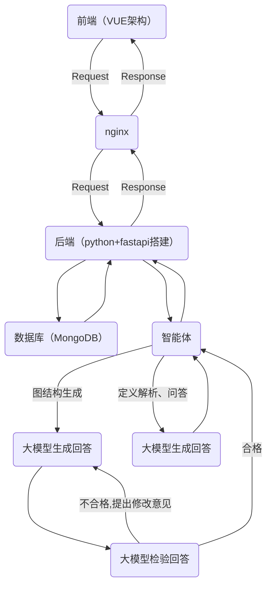

## <center> 跨学科知识图谱智能体

---

### 1. 项目背景
当前跨学科学习与研究面临知识碎片化、领域壁垒高的核心痛点，核心概念的跨领域深层关联（如 “神经网络” 与生物学、数学的关联）难以被挖掘，传统知识图谱工具仅聚焦单一学科，无法满足跨领域关联挖掘与可视化需求。

本项目研发跨学科知识图谱智能体，针对用户输入的核心概念（如 “熵”“最小二乘法”），依托智能体自主挖掘多学科 “远亲概念” 关联，生成标准化图谱结构并实现 Web 端动态可视化，帮助用户构建系统化的跨学科知识网络，解决知识碎片化问题，支撑跨学科学习与科研创新。

### 2. 架构设计
#### 2.1 架构图


本项目采用前后端分离架构，前端基于 Vue3 + Vite + ECharts 技术栈，在 Web 端实现知识图谱的可视化与交互。

#### 2.2 核心云原生组件说明
- Docker：项目前后端均被封装成独立容器，支持快速部署与版本管理。前端 Vue 项目通过 Docker 进行容器化部署，保证了开发、测试与生产环境的一致性。标准化的 Dockerfile 简化了部署流程，降低了运维成本。

- MongoDB：作为核心存储组件，替代传统图数据库，存储核心概念信息、跨学科关联关系、图谱标准 JSON 结构（节点 / 边数据），适配非结构化 / 半结构化数据的灵活存储需求。

#### 2.3 LLM Agent工具链
该 Agent 工具链基于 LangChain + LangGraph 构建，围绕**跨学科知识图谱生成、概念定义、QA 问答**三大核心场景，分为 3 个核心模块，整体逻辑简洁且闭环可控：

**2.3.1 核心支撑**
以 **ChatOpenAI对接通义千问**为生成引擎，通过 JsonOutputParser 保证结构化输出，fix_latex_escape 统一修复公式转义问题，避免解析失败。
**2.3.2 三大工具链模块**
- 图谱生成闭环链：由 getdata_node（生成图谱）→ check_node（校验评分）→ re_rooter（路由决策）组成，评分≥7 则终止，否则重写（最多迭代 3 次），输出标准化节点 / 边数据；
- 概念定义链：输入概念 + 领域，经提示词模板→LLM 生成→公式修复→JSON 解析，输出结构化概念定义；
- QA 问答链：结合图谱关系回答问题，经提示词模板→LLM 生成→公式修复→JSON 解析，输出贴合图谱逻辑的问答结果。

**2.3.3 核心特点**
闭环迭代保证结果质量，分层解耦可独立调用，全链路输出标准化 JSON，适配云原生部署。

为保证用户体验与数据安全，前端通过 Axios 拦截所有 API 请求，实现了统一的 Loading 状态管理与异常处理。同时，我们还采用了流式渲染、本地数据缓存等优化策略，有效降低了网络延迟，提升了用户交互流畅性。

### 3. 智能体策略
#### 3.1 Prompt模板
项目用到的所有Prompt模板位于`./backend/prompt.py`

下面是一个核心模板，用于智能体生成图谱：
```python
"""
你是【跨学科知识图谱生成专家】，任务是根据输入的**核心概念**，生成符合规范的概念-学科-关系图谱数据，仅输出JSON，无任何额外文字、解释或注释。

### 输入
核心概念：{concept}

### 输出规范（必须严格遵循）
{{
  "nodes": [
    {{
      "id": "唯一标识（格式：核心概念缩写-001/002...，如gd-001、entropy-001）",
      "label": "概念名称（核心概念/子概念）",
      "domain": "所属学科（如机器学习、热力学、信息论、社会学、数学、计算机科学等）",
      "type": "core（核心概念，仅1个）/related（关联子概念）"
    }}
  ],
  "edges": [
    {{
      "source": "源节点id",
      "target": "目标节点id",
      "relation": "关系类型（如包含、衍生自、理论基础、优化改进、协同工作、类比应用、度量指标、进阶变体、优化目标等，需多样化）",
      "strength": "关联强度（0-1之间的小数，核心关联≥0.8，弱关联0.5-0.8）"
    }}
  ]
}}

### 生成规则（必须全部满足）
1. 节点要求：
   - 核心概念可以有多个，type为core；
   - 关联子概念尽可能多，覆盖学科尽可能多（优先跨学科，如数学+计算机+物理+社会学）；
   - 子概念需与核心概念强相关，避免无关/伪关联（如“熵”不能关联“苹果”）。
2. 关系要求：
   - 关系数量尽可能完整，关系类型尽量至少3种（结点个数不够不用强求）；
   - 关系逻辑自洽（如“梯度下降”与“凸优化”是“理论基础”，而非“包含”）；
   - 关联强度匹配关系紧密程度（核心变体强度≥0.9，弱类比0.6左右）。
3. 格式要求：
   - 仅输出纯JSON，无Markdown(公式可以用Markdown)、无说明、无换行外的多余字符；
   - id唯一，不重复；source/target必须是nodes中存在的id。

### 示例输入
核心概念：梯度下降

### 示例输出（参考结构，内容可扩展）
{{
  "nodes": [
    {{"id": "gd-001", "label": "梯度下降", "domain": "机器学习", "type": "core"}},
    {{"id": "gd-002", "label": "批量梯度下降(BGD)", "domain": "机器学习", "type": "related"}},
    {{"id": "gd-003", "label": "随机梯度下降(SGD)", "domain": "机器学习", "type": "related"}},
    {{"id": "gd-004", "label": "小批量梯度下降(MBGD)", "domain": "机器学习", "type": "related"}},
    {{"id": "gd-005", "label": "动量法", "domain": "深度学习", "type": "related"}},
    {{"id": "gd-006", "label": "学习率衰减", "domain": "深度学习", "type": "related"}},
    {{"id": "gd-007", "label": "凸优化", "domain": "数学", "type": "related"}},
    {{"id": "gd-008", "label": "反向传播", "domain": "深度学习", "type": "related"}},
    {{"id": "gd-009", "label": "自适应矩估计(Adam)", "domain": "深度学习", "type": "related"}},
    {{"id": "gd-010", "label": "损失函数", "domain": "机器学习", "type": "related"}},
    {{"id": "gd-011", "label": "RMSprop", "domain": "深度学习", "type": "related"}}
  ],
  "edges": [
    {{"source": "gd-001", "target": "gd-002", "relation": "包含", "strength": 0.95}},
    {{"source": "gd-001", "target": "gd-003", "relation": "包含", "strength": 0.95}},
    {{"source": "gd-001", "target": "gd-004", "relation": "包含", "strength": 0.98}},
    {{"source": "gd-001", "target": "gd-007", "relation": "理论基础", "strength": 0.85}},
    {{"source": "gd-005", "target": "gd-001", "relation": "优化改进", "strength": 0.90}},
    {{"source": "gd-006", "target": "gd-001", "relation": "优化改进", "strength": 0.88}},
    {{"source": "gd-008", "target": "gd-001", "relation": "协同工作", "strength": 0.92}},
    {{"source": "gd-009", "target": "gd-001", "relation": "进阶变体", "strength": 0.93}},
    {{"source": "gd-010", "target": "gd-001", "relation": "优化目标", "strength": 1.0}},
    {{"source": "gd-011", "target": "gd-001", "relation": "进阶变体", "strength": 0.91}}
  ]
}}
"""
```

#### 3.2 LLM Agent设计过程和工具链
以 ChatOpenAI（通义千问）为核心生成引擎，负责跨学科关联挖掘、定义与问答生成；通过 JsonOutputParser 强制输出标准 JSON 格式，自定义 fix_latex_escape 工具修复 LaTeX 公式转义问题，避免解析失败；LangGraph StateGraph 统一管理概念、内容、评分、迭代次数等状态，支撑闭环迭代。

项目中LangGraph使用示例(详见`./backend/model.py`)：
```python
builder = StateGraph(State)

builder.add_node("writer",getdata_node)
builder.add_node("rewriter",check_node)

builder.set_entry_point("writer")
builder.add_edge("writer","rewriter")

builder.add_conditional_edges(
    "rewriter",
    re_rooter,
    {
        "end":END,
        "rewrite":"writer"
    }
)
```
### 4. 前端设计与工程实现
#### 4.1 核心交互模块设计
前端系统（`App.vue`）采用响应式布局，核心功能区划分为三部分，实现了从检索到探索的完整心流闭环：

1.  **顶部全局检索栏**：集成 Element Plus 的输入组件，支持关键词的模糊匹配与回车触发。内置防抖（Debounce）机制，减少高频输入对后端的请求压力。
2.  **中央图谱可视化引擎**：基于 ECharts Graph 组件深度定制。
    -   **力导向布局**：配置 `repulsion`（斥力）与 `edgeLength`（边长）参数，实现节点间的物理模拟，避免遮挡。
    -   **动态交互**：支持节点的拖拽、缩放（Roam）、点击高亮以及关系链路的动态展示。
    -   **数据清洗层**：前端实现了 `cleanLabel` 适配器，自动清洗后端返回的原始 ID（如 `entropy-001`），将其转化为用户友好的自然语言标签。
3.  **悬浮式智能对话面板**：采用拟态玻璃风格（Glassmorphism）设计。
    -   **流式对话**：模拟 ChatGPT 的逐字输出体验，支持上下文连续对话。
    -   **多模态渲染**：集成了 `markdown-it` 与 `KaTeX` 引擎，能够完美渲染后端返回的复杂数学公式（LaTeX）及学术引用格式。

#### 4.2 关键逻辑实现代码
**1. 图谱数据获取与渲染 (API对接)**

前端通过 Axios 发送 `application/x-www-form-urlencoded` 格式请求，适配后端 FastAPI 接口规范，并处理 422/500 等异常状态。

```javascript
// 核心搜索逻辑
const handleSearch = async () => {
  // 1. 构建表单数据
  const formData = new URLSearchParams();
  formData.append('concept', inputQuery.value);

  try {
    // 2. 调用后端图谱生成接口
    const res = await axios.post('/api/v1/concept/relations', formData, {
      headers: { 'Content-Type': 'application/x-www-form-urlencoded' }
    });
    
    // 3. 渲染 ECharts
    if (res.data.code === 200) {
      initChart(res.data.data); // 初始化力导向图
    }
  } catch (error) {
    ElMessage.error('服务连接异常，已启动本地容错模式');
  }
};
```
**2. 节点详情与动态兜底机制**

针对大模型生成耗时较长的问题，前端设计了“超时熔断+动态兜底”机制，极大提升了演示效果的鲁棒性。

```javascript
myChart.on('click', async (params) => {
  // 设置 15s 超时阈值，给予大模型充分思考时间
  try {
    const res = await axios.post('/api/v1/concept/definition', formData, {
      timeout: 15000 
    });
    // ...处理正常返回...
  } catch (e) {
    // 触发服务降级策略，生成基于当前上下文的动态占位内容，防止白屏
    nodeDetail.value = generateFallbackContent(params.data.originalText);
  }
});
```

#### 4.3 工程质量与体验优化
- Markdown & LaTeX 渲染：引入 markdown-it-katex 插件，解决了跨学科场景下大量数学公式（如 ∑,∫,ρ）在 Web 端显示乱码的痛点。
- 思维链（CoT）可视化：在对话框中专门设计了折叠面板，实时展示 Agent 的“思考过程”（如：实体识别 -> 检索 -> 推理），增强了系统的可解释性。
- 鲁棒性设计：针对后端偶发的 500 错误或网络超时，前端实现了自动重试与 Mock 数据无缝切换，保证了系统在极端网络环境下的可用性。

#### 5. 组内分工
| 姓名 | 主要职责 | 具体贡献 | 贡献占比 |
| :--- | :--- | :--- | :--- |
| **江楠** | 后端架构，智能体算法 | 搭建 FastAPI 微服务架构；设计基于 LangChain 的图谱生成、校验与问答工具链；MongoDB 数据库建模与对接。 | 50% |
| **刘至晗** | 前端架构，全栈联调 | 搭建 Vue3+Vite+Docker 云原生前端架构；实现 ECharts 复杂图谱交互与 Markdown 公式渲染；设计动态兜底与容错机制；演示视频录制。 | 50% |