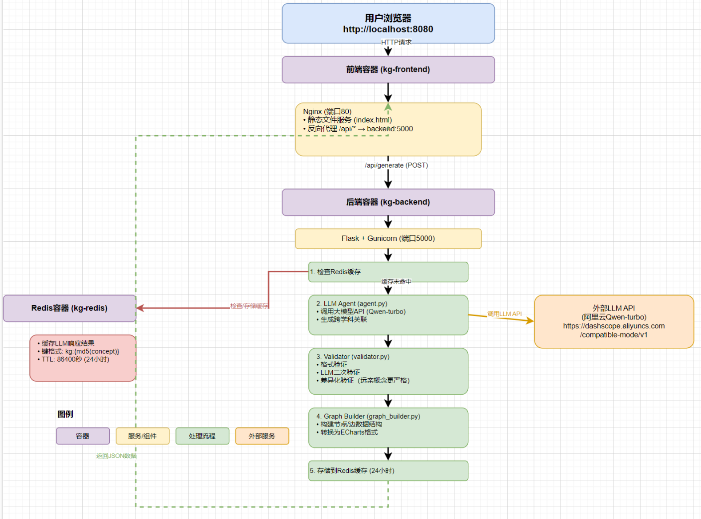

# 跨学科知识图谱智能体

## 项目背景

在学习过程中，我们经常遇到知识碎片化的问题。比如学习"神经网络"时，很难理解它和生物学、高等数学之间的深层联系。这个项目就是为了解决这个问题——通过LLM智能体自动挖掘跨学科概念之间的关联，并生成可视化的知识图谱。

## 核心功能

- **跨学科关联挖掘**：输入一个核心概念（如"熵"、"神经网络"），系统会在数学、物理、计算机、生物、社会学等多个学科领域寻找相关概念
- **知识图谱构建**：将挖掘到的关联转换为标准的图数据结构（节点+边）
- **交互式可视化**：使用ECharts在Web端渲染可交互的知识图谱，节点大小、形状、颜色都有区分
- **多层验证机制**：通过校验层确保生成的知识准确可靠，特别是对"远亲概念"和"类比"关系进行严格验证

## 技术架构

### 系统架构图

```
┌─────────────────────────────────────────────────────────────┐
│                        用户浏览器                              │
│                    http://localhost:8080                      │
└──────────────────────────┬────────────────────────────────────┘
                           │ HTTP请求
                           ↓
┌─────────────────────────────────────────────────────────────┐
│  前端容器 (kg-frontend)                                       │
│  ┌─────────────────────────────────────────────────────┐   │
│  │  Nginx (端口80)                                      │   │
│  │  - 静态文件服务 (index.html)                         │   │
│  │  - 反向代理 /api/* → backend:5000                   │   │
│  └─────────────────────────────────────────────────────┘   │
└──────────────────────────┬────────────────────────────────────┘
                           │ /api/generate (POST)
                           ↓
┌─────────────────────────────────────────────────────────────┐
│  后端容器 (kg-backend)                                       │
│  ┌─────────────────────────────────────────────────────┐   │
│  │  Flask + Gunicorn (端口5000)                         │   │
│  │  ┌───────────────────────────────────────────────┐   │   │
│  │  │ 1. 检查Redis缓存                              │   │   │
│  │  └───────────────┬───────────────────────────────┘   │   │
│  │                  │ 缓存未命中                         │   │
│  │  ┌───────────────▼───────────────────────────────┐   │   │
│  │  │ 2. LLM Agent (agent.py)                      │   │   │
│  │  │    - 调用大模型API (Qwen-turbo)              │   │   │
│  │  │    - 生成跨学科关联                          │   │   │
│  │  └───────────────┬───────────────────────────────┘   │   │
│  │                  ↓                                   │   │
│  │  ┌───────────────────────────────────────────────┐   │   │
│  │  │ 3. Validator (validator.py)                   │   │   │
│  │  │    - 格式验证                                 │   │   │
│  │  │    - LLM二次验证                              │   │   │
│  │  │    - 差异化验证（远亲概念更严格）             │   │   │
│  │  └───────────────┬───────────────────────────────┘   │   │
│  │                  ↓                                   │   │
│  │  ┌───────────────────────────────────────────────┐   │   │
│  │  │ 4. Graph Builder (graph_builder.py)          │   │   │
│  │  │    - 构建节点/边数据结构                      │   │   │
│  │  │    - 转换为ECharts格式                       │   │   │
│  │  └───────────────┬───────────────────────────────┘   │   │
│  │                  ↓                                   │   │
│  │  ┌───────────────────────────────────────────────┐   │   │
│  │  │ 5. 存储到Redis缓存 (24小时)                   │   │   │
│  │  └───────────────┬───────────────────────────────┘   │   │
│  └──────────────────┼───────────────────────────────────┘   │
│                     │ 返回JSON                                │
└─────────────────────┼─────────────────────────────────────────┘
                      │
                      ↓
┌─────────────────────────────────────────────────────────────┐
│  Redis容器 (kg-redis)                                       │
│  - 缓存LLM响应结果                                           │
│  - 键格式: kg:{md5(concept)}                                │
│  - TTL: 86400秒 (24小时)                                    │
└─────────────────────────────────────────────────────────────┘
                      │
                      ↓
┌─────────────────────────────────────────────────────────────┐
│  外部LLM API (阿里云Qwen-turbo)                             │
│  https://dashscope.aliyuncs.com/compatible-mode/v1          │
└─────────────────────────────────────────────────────────────┘
```

**这里做了可视化技术框架图：**



系统采用前后端分离的微服务架构，使用Docker容器化部署，体现了云原生特性。

### 数据流向

1. **用户请求**：用户在浏览器输入概念，点击"生成图谱"
2. **前端处理**：前端通过Ajax发送POST请求到 `/api/generate`
3. **Nginx代理**：Nginx将 `/api/*` 请求转发到后端容器 `backend:5000`
4. **缓存检查**：后端首先检查Redis中是否有该概念的缓存
5. **LLM调用**：如果缓存未命中，调用LLM API生成关联
6. **多层验证**：通过Validator进行格式验证和逻辑验证
7. **图谱构建**：Graph Builder将验证后的数据转换为图结构
8. **缓存存储**：结果存储到Redis，24小时有效
9. **返回前端**：JSON数据返回给前端，ECharts渲染可视化

### 云原生组件详解

#### Docker容器化

- **后端容器** (`kg-backend`)：

  - 基于 `python:3.9-slim`
  - 使用Gunicorn作为WSGI服务器（2个worker进程）
  - 健康检查：每30秒检查一次 `/health` 端点
  - 自动重启：容器异常退出时自动重启
- **前端容器** (`kg-frontend`)：
  - 基于 `nginx:alpine`（轻量级）
  - 静态文件服务 + 反向代理
  - 配置了CORS和超时设置（120秒）
- **Redis容器** (`kg-redis`)：

  - 基于 `redis:7-alpine`
  - 数据持久化：AOF（Append Only File）
  - 数据卷：`redis-data` 持久化存储

#### Docker Compose编排

- **服务依赖**：`backend` 依赖 `redis`，`frontend` 依赖 `backend`
- **网络隔离**：所有服务在 `kg-network` 桥接网络中
- **数据持久化**：Redis数据存储在命名卷中，容器删除后数据不丢失
- **一键启动**：`docker-compose up -d` 启动所有服务

#### Redis缓存策略

- **缓存键**：`kg:{md5(concept)}`，确保相同概念使用相同缓存
- **TTL**：24小时（86400秒），平衡性能和实时性
- **性能提升**：相同概念第二次查询时，响应时间从10-30秒降至毫秒级

#### Nginx反向代理

- **静态文件**：直接服务 `frontend/index.html`
- **API代理**：`/api/*` 转发到 `http://backend:5000/api/*`
- **超时配置**：120秒，适应LLM API的较长响应时间

### 技术栈

- **后端**：Python 3.9 + Flask + Gunicorn
- **LLM**：支持OpenAI兼容API（当前使用阿里云Qwen-turbo）
- **缓存**：Redis 7
- **前端**：HTML + ECharts（关系图可视化）
- **图数据**：轻量级JSON结构（节点+边），存储在Redis中

## 快速开始

### 环境要求

- Docker 20.0+ 和 Docker Compose 2.0+
- 大模型API Key（OpenAI或其他兼容服务）

### 部署步骤

1. **克隆项目**

```bash
git clone <your-repo-url>
cd knowledge-graph-agent
```

2. **配置环境变量**

创建 `.env` 文件，配置API密钥：

```bash
MAAS_API_KEY=your_api_key
MAAS_API_ENDPOINT=https://dashscope.aliyuncs.com/compatible-mode/v1
MAAS_MODEL_NAME=qwen-turbo
REDIS_HOST=redis
REDIS_PORT=6379
```

3. **启动服务**

```bash
docker-compose up -d
```

4. **访问系统**

打开浏览器访问 `http://localhost:8080`

### 本地开发

如果想在本地开发调试：

```bash
# 安装Python依赖
pip install -r requirements.txt

# 启动Redis（如果还没启动）
docker run -d -p 6379:6379 redis:alpine

# 启动后端（在项目根目录）
python -m backend.app

# 前端可以用简单的HTTP服务器（Python 3）
cd frontend
python -m http.server 8080
```

## 项目结构

```
knowledge-graph-agent/
├── backend/                    # 后端服务
│   ├── app.py                 # Flask主应用，提供REST API
│   ├── agent.py               # LLM Agent核心逻辑，调用大模型API
│   ├── validator.py           # 校验层，验证关联的合理性
│   ├── graph_builder.py       # 图谱构建器，生成节点/边数据结构
│   └── prompts.py            # Prompt模板，定义LLM的输入提示词
├── frontend/                  # 前端页面
│   └── index.html            # 主页面，包含ECharts可视化
├── docker/                    # Docker配置
│   ├── Dockerfile.backend    # 后端容器镜像
│   ├── Dockerfile.frontend   # 前端容器镜像
│   └── nginx.conf            # Nginx配置文件
├── docker-compose.yml        # 容器编排配置
├── requirements.txt          # Python依赖
└── README.md                 # 项目文档
```

## 智能体策略

### LLM Agent工具链

```
输入概念
    ↓
[Agent.mine_relations()]
    ├─→ 调用LLM API (prompts.py)
    ├─→ 解析JSON响应
    └─→ Fallback机制 (如果API失败)
    ↓
[Validator.validate_graph()]
    ├─→ 格式验证 (_validate_format)
    ├─→ LLM二次验证 (agent.validate_relation)
    └─→ 差异化验证 (远亲概念更严格)
    ↓
[GraphBuilder.build_graph()]
    ├─→ 构建节点列表 (_build_nodes)
    ├─→ 构建边列表 (_build_edges)
    └─→ 构建分类信息 (_build_categories)
    ↓
输出ECharts格式JSON
```

### Prompt模板设计

#### 1. 系统提示词 (SYSTEM_PROMPT)

```python
SYSTEM_PROMPT = """你是一个跨学科知识图谱专家，擅长发现不同学科领域之间的深层联系。
你的任务是帮助用户理解一个概念在多个学科中的应用和关联。

请遵循以下原则：
1. 准确性：只提供有科学依据的关联
2. 多样性：涵盖至少5个不同学科领域
3. 深度：解释关联的本质原因
4. 结构化：以JSON格式输出结果
"""
```

**设计思路：**

- 明确Agent的角色定位（跨学科专家）
- 强调准确性和多样性（防止幻觉和单一学科）
- 要求结构化输出（便于后续解析）

#### 2. 关联挖掘提示词 (RELATION_MINING_PROMPT)

**核心要求：**

- 强制要求至少涵盖7个学科领域（数学、物理、计算机、生物、社会学、经济学、心理学）
- 明确要求5种关系类型：直接关联、理论基础、应用、类比、远亲概念
- **关键**：对于"类比"和"远亲概念"，必须说明桥梁概念
- 要求80-150字的详细描述，必须包含理论依据

**Prompt模板：**

```python
RELATION_MINING_PROMPT = """请分析概念"{concept}"在不同学科领域的关联。

要求：
1. 至少涵盖以下学科领域：数学、物理、计算机科学、生物学、社会学、经济学、心理学
2. 对每个学科，找出1-3个相关概念
3. 明确说明关联的桥梁概念（连接两个概念的中间概念或理论）
4. 说明这些概念与核心概念的关系类型：
   - "直接关联"：直接的理论或应用关系
   - "理论基础"：作为理论基础的关系
   - "应用"：实际应用场景
   - "类比"：通过类比建立的关联（必须说明类比的基础）
   - "远亲概念"：通过桥梁概念连接的远距离关联（必须明确说明桥梁）
5. 提供详细的关系描述（80-150字），必须包含：
   - 桥梁概念是什么
   - 为什么这两个概念有关联
   - 关联的具体理论依据或应用场景

请以以下JSON格式输出：
{
  "core_concept": "{concept}",
  "relations": [
    {
      "discipline": "学科名称",
      "related_concept": "相关概念",
      "relation_type": "关系类型",
      "bridge_concept": "桥梁概念",
      "description": "关系描述（80-150字）"
    }
  ]
}
"""
```

**设计迭代过程：**

1. **初版**：只要求找出相关概念，没有关系类型和桥梁概念
2. **第二版**：添加关系类型，但桥梁概念要求不明确
3. **第三版（当前）**：明确要求桥梁概念，特别是对"类比"和"远亲概念"强制要求

#### 3. 验证提示词 (VALIDATION_PROMPT)

**设计目的：** 防止LLM幻觉，二次验证关联的合理性

**关键点：**

- 要求验证桥梁概念是否合理
- 根据关系类型给出不同的置信度评分标准
- 对"类比"和"远亲概念"要求更严格（置信度0.4-0.7）

```python
VALIDATION_PROMPT = """请验证以下概念关联是否合理：

核心概念：{core_concept}
相关概念：{related_concept}
学科领域：{discipline}
关系类型：{relation_type}
桥梁概念：{bridge_concept}
关系描述：{description}

请严格判断：
1. 这个关联是否真实存在？是否有科学依据？
2. 如果关系类型是"类比"或"远亲概念"，桥梁概念是否合理？
3. 描述是否准确？是否说明了关联的理论依据？
4. 是否存在明显错误或幻觉？

评分标准：
- 直接关联：置信度 0.8-1.0
- 理论基础/应用：置信度 0.7-0.9
- 类比（桥梁合理）：置信度 0.5-0.7
- 远亲概念（桥梁合理）：置信度 0.4-0.6
- 桥梁不合理或关联牵强：置信度 < 0.4
"""
```

### Agent设计过程

#### 第一阶段：基础功能实现

- 实现基本的LLM API调用
- 简单的Prompt模板
- 基础的JSON解析

#### 第二阶段：验证机制

- 发现LLM存在幻觉问题
- 实现格式验证（检查必填字段、描述长度）
- 实现LLM二次验证（调用LLM验证关联合理性）

#### 第三阶段：优化Prompt

- 发现"远亲概念"缺乏桥梁概念说明
- 优化Prompt，明确要求桥梁概念
- 增强描述要求（80-150字，包含理论依据）

#### 第四阶段：差异化验证

- 发现"类比"和"远亲概念"需要更严格验证
- 实现差异化验证逻辑：
  - 直接关联/理论基础/应用：标准阈值（0.3）
  - 类比/远亲概念：更严格（0.4），必须有桥梁概念

#### 第五阶段：容错机制

- LLM API不稳定，经常失败
- 实现fallback机制，根据概念关键词匹配生成合理结果
- 实现重试机制（最多3次，指数退避）

### 校验层（Check Layer）设计

**三层验证机制：**

1. **格式验证** (`_validate_format`)

   - 检查必填字段：`discipline`, `related_concept`, `relation_type`, `description`
   - 检查描述长度：20-500字符
   - **关键**：检查"类比"和"远亲概念"是否包含桥梁概念
2. **LLM二次验证** (`agent.validate_relation`)

   - 调用LLM再次验证关联的合理性
   - 返回置信度（0.0-1.0）和验证理由
   - 特别检查桥梁概念是否合理
3. **差异化验证** (`validate_graph`)

   - 直接关联/理论基础/应用：`confidence >= 0.3` 通过
   - 类比/远亲概念：`confidence >= 0.4` 且必须有桥梁概念
   - 确保"远亲概念"的逻辑合理性（符合作业考核指标）

### 校验层（Check Layer）

为了防止LLM幻觉，实现了多层校验：

1. **格式校验**：检查必填字段、描述长度、桥梁概念是否存在
2. **LLM二次验证**：调用LLM验证关联的合理性，返回置信度
3. **差异化验证**：
   - 直接关联/理论基础/应用：标准阈值（0.3）
   - 类比/远亲概念：更严格（0.4），必须有桥梁概念

### 可视化设计

前端使用ECharts实现交互式图谱：

- **节点差异化**：
  - 核心概念：大圆形，蓝色边框
  - 不同学科：不同形状（圆形、方形、菱形等）
  - 不同关系类型：不同颜色边框（直接关联-绿色，类比-橙色，远亲概念-红色等）
- **交互功能**：鼠标悬停显示详细信息（包括桥梁概念、关系类型、描述）
- **布局算法**：使用力导向布局，核心节点排斥力更大

## 使用示例

1. 在输入框输入核心概念，如："熵"
2. 点击"生成图谱"按钮
3. 系统自动分析并在多个学科领域寻找关联（数学、物理、生物、社会学等）
4. 生成交互式知识图谱，可以：
   - 拖拽节点调整位置
   - 鼠标悬停查看详细信息
   - 通过节点大小、形状、颜色区分不同学科和关系类型

## 分工说明

#### ps：我们组选择——按贡献度差异评分

### 成员A：吕欣萌（70%）- 后端/架构组

**负责模块：**

- `backend/agent.py` - LLM Agent核心逻辑
- `backend/prompts.py` - Prompt模板设计
- `backend/validator.py` - 校验层实现
- `backend/graph_builder.py` - 图谱构建器
- `backend/app.py` - Flask应用主入口和API路由
- `docker/Dockerfile.backend` - 后端容器镜像构建
- `docker-compose.yml` - 多容器编排配置
- `docker/nginx.conf` - Nginx配置和反向代理
- `requirements.txt` - Python依赖管理

**具体工作：**

1. **LLM Agent开发**：

   - 设计LLM Agent调用流程，实现重试和异常处理
   - 设计Prompt模板，明确要求桥梁概念和理论依据
   - 实现fallback机制，根据概念关键词匹配生成合理结果
2. **验证机制实现**：

   - 实现多层验证机制（格式验证、LLM二次验证、差异化验证）
   - 优化验证逻辑，对"远亲概念"和"类比"进行更严格检查
3. **图谱构建**：

   - 构建图谱数据结构，转换为ECharts可用格式
4. **系统架构**：

   - 设计系统架构，确定前后端分离和容器化方案
   - 编写Dockerfile，优化镜像大小和构建速度
   - 配置Docker Compose，实现服务依赖和网络隔离
   - 配置Nginx反向代理，解决CORS和超时问题
   - 配置Gunicorn生产环境，设置worker数量和超时
   - 实现Redis缓存集成和健康检查机制
5. **系统集成**：
   - 系统集成测试和部署调试
6. **文档编写**：
   - 编写项目文档（README.md）
   - 整理项目具体流程+可视化框架图实现+demo

**代码贡献：**

- `backend/agent.py` (100%)
- `backend/prompts.py` (100%)
- `backend/validator.py` (100%)
- `backend/graph_builder.py` (100%)
- `backend/app.py` (100%)
- `docker-compose.yml` (100%)
- `docker/Dockerfile.backend` (100%)
- `docker/nginx.conf` (100%)
- `requirements.txt` (100%)

### 成员B：李思彤（30%）- 前端/可视化组

**负责模块：**

- `frontend/index.html` - 前端页面和可视化
- `docker/Dockerfile.frontend` - 前端容器镜像构建
- `README.md` - 项目文档

**具体工作：**

1. **前端开发**：

   - 设计前端UI，实现暗色主题和现代化界面
   - 集成ECharts，实现交互式知识图谱可视化
   - 优化节点样式（大小、形状、颜色）区分不同学科和关系类型
   - 实现交互功能（拖拽、悬停提示、图例）
2. **前端容器化**：

   - 编写前端Dockerfile，配置Nginx静态文件服务
3. **问题解决**：

   - 解决ECharts配置问题，确保节点样式正确应用
   - 解决CORS跨域问题
4. **文档编写**：
   - 编写项目文档（README.md）
   - 整理项目结构和使用说明

**代码贡献：**

- `frontend/index.html` (100%)
- `docker/Dockerfile.frontend` (100%)
- `README.md` (50%)

## 技术亮点

1. **云原生架构**：完全容器化部署，使用Docker Compose一键启动，便于扩展和维护
2. **多层验证**：针对LLM幻觉问题，实现了格式验证+LLM二次验证+差异化验证的三层校验机制
3. **Prompt工程**：精心设计的Prompt模板，明确要求桥梁概念和理论依据，确保生成的知识合理
4. **性能优化**：使用Redis缓存LLM响应，避免重复调用API，提升用户体验
5. **容错机制**：LLM API失败时有智能fallback，根据概念关键词匹配生成合理结果

## 遇到的问题和解决方案

1. **LLM API不稳定**：实现了重试机制（最多3次，指数退避）和fallback方案（根据概念关键词匹配）
2. **LLM幻觉问题**：通过多层校验（格式验证+LLM二次验证+差异化验证）和严格验证，特别是对"远亲概念"要求桥梁概念
3. **前端可视化**：优化了ECharts配置，解决了节点样式不生效的问题（移除函数形式配置，改为预处理数据），实现了差异化展示
4. **Docker部署**：解决了健康检查（使用Python代替curl）、CORS跨域（Nginx配置）、Redis连接（环境变量配置）等问题
